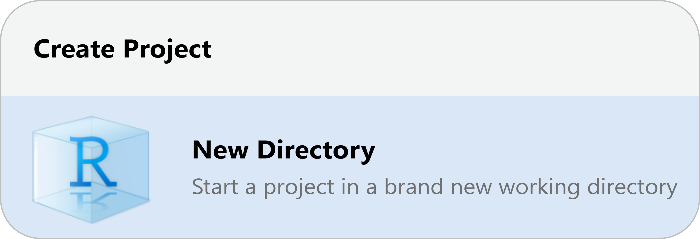

```{r setup, include=FALSE}
library(rmarkdown)
library(knitr)
library(magrittr)

opts_chunk$set(error=TRUE, color=NULL, message=FALSE, eval=T)
htmltools::tagList(rmarkdown::html_dependency_font_awesome())
```


class: inverse, center, middle

# .big[.big[R]] 
# .huge[.teal[BAKERY]]

---
class: middle, inverse

# <i class="fa fa-cake-candles teal" aria-hidden="true"></i> New R project

Let's start a new project in RStudio




---
exclude: true

```{r set-params, include=F}
params <- list(name1 = '01_bakery.R', name2 = 'day1.R')
```

```{r, child='../../modules-slides/intro/rstudio_newproject/general.Rmd'}
```

---
class: middle
exclude: true

# Names and things
<hr>
<br>


---
class: inverse

# <i class="fa-solid fa-cookie-bite" aria-hidden="true" style="color: gray;"></i> .link-blue[Taste test]
<hr><br>


```{r, echo=F, eval=F}
#<i class="fa-solid fa-cookie-bite" style="color: #bacff2;"></i>
```

<div class="quiz">

<h3>Which object name <u>is</u> allowed?</h3>

<i>Hint: You can try the names in R</i>

<p>

<input type="radio" name="object"> <code>my favorite bot</code> <br>
<input type="radio" name="object"> <code>my-bot</code>          <br>
<input type="radio" name="object"> <code>5bots</code>           <br>
<input type="radio" name="object"> <code>my_bot55</code>        <br>
<input type="radio" name="object"> <code>BOTS!!!</code>         <br>

</p>

<details>
<summary class="quiz_btn">Show solution</summary>

<p style="margin-bottom: 0; margin-top: 4px;">
<i class="fa-solid fa-circle-check" style="color: #38b7b5;"></i> <code>my_bot55</code>
</p>
</details>
</div>


---
class: inverse, center, middle

# <i class="fas fa-carrot" aria-hidden="true"></i> [Back to Videos](https://tidy-mn.github.io/R-camp-penguins/page/videos.html)
