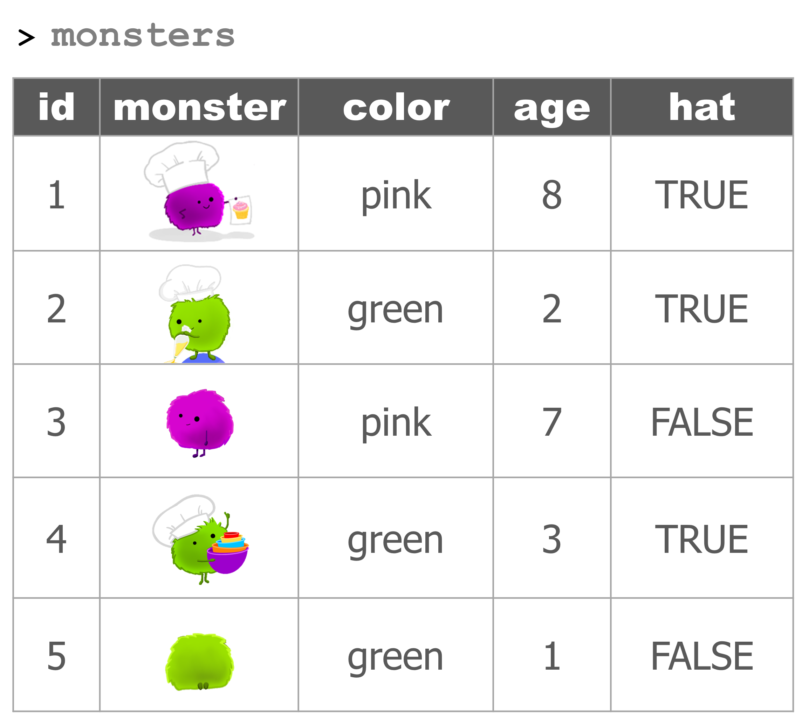
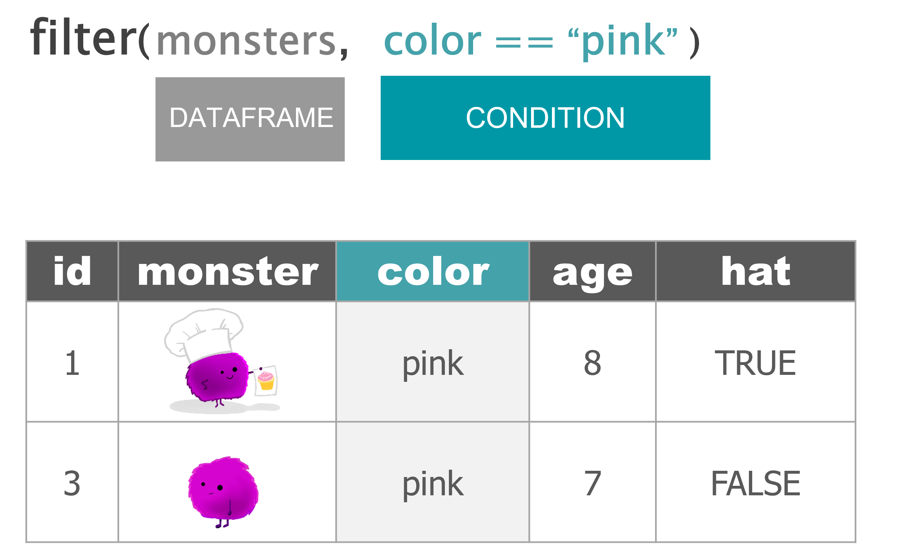
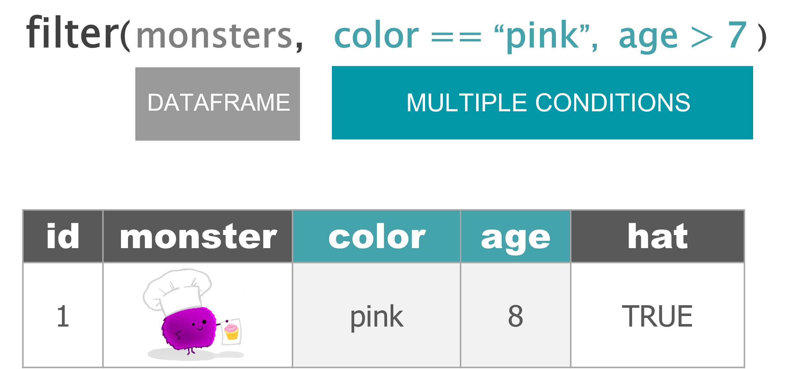

```{r setup, include=FALSE}
library(rmarkdown)
library(knitr)
library(magrittr)

xaringanExtra::use_clipboard()

opts_chunk$set(error=TRUE, color=NULL, message=FALSE, eval=T)
htmltools::tagList(rmarkdown::html_dependency_font_awesome())
```


class: inverse, center, middle
exclude: true

# .big[TIDY] 
# .huge[.teal[DATA]]

---
class: inverse

```{r child = '../../modules-slides/base/base_dataframes/bakery.Rmd'}
```

---
class: 

<div style="height: 240px; overflow: hidden; margin-top: 16px; margin-left: -240px; width: 140%;">

</div>

---

<style>
.aqua {color: #0098a6;}
.gray {color: gray;}
</style>

# Meet the .gray[monsters]



---

<div style="height: 170px; overflow:hidden;">

</div>

--

<div style="height: 430px; overflow:hidden; margin-top: 20px;">

</div>

---

<div style="height: 170px; overflow:hidden;">

</div>

--

<div style="height: 430px; overflow:hidden; margin-top: 20px;">

</div>

---

# Key terms

```{r key-terms, child='../../modules-slides/key_terms/day1.Rmd'}
```

---
class: inverse, center, middle

# <i class="fas fa-carrot" aria-hidden="true"></i> [Back to Videos](https://tidy-mn.github.io/R-camp-penguins/page/videos.html)
