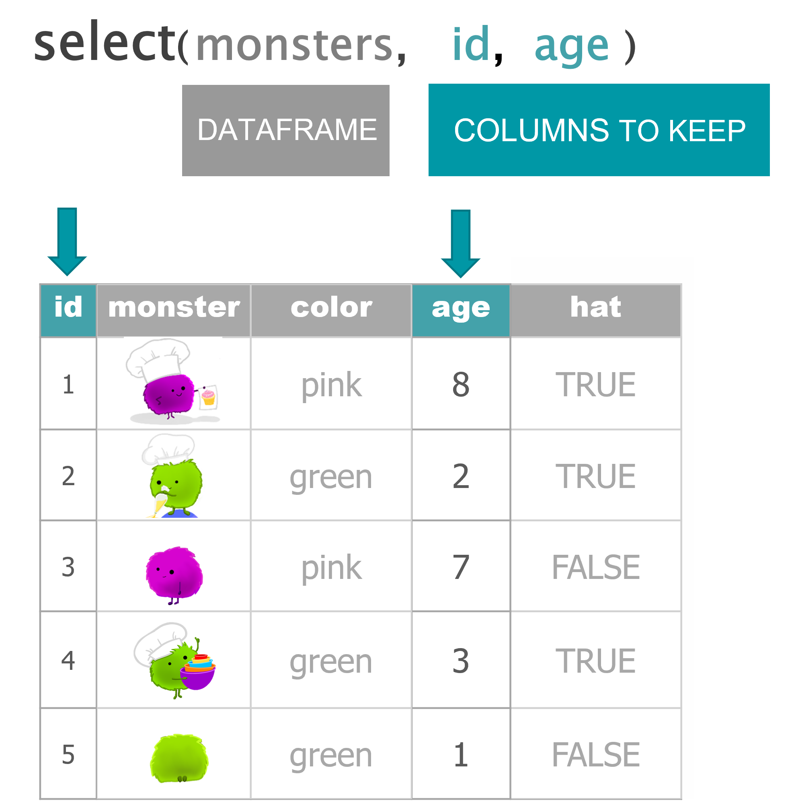
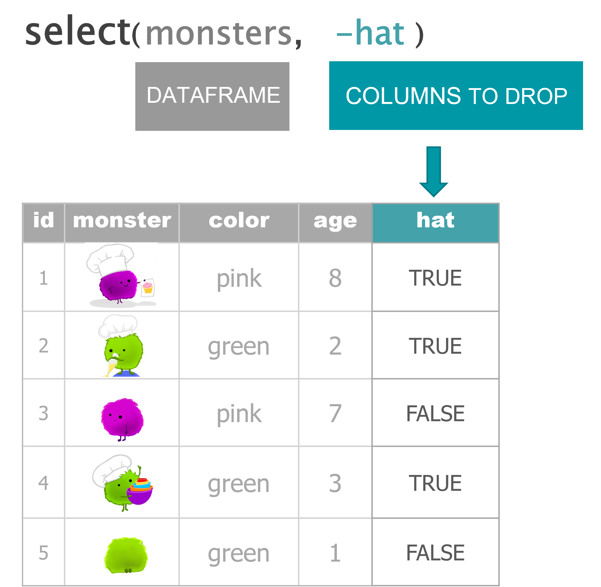

```{r setup, include=FALSE}
library(rmarkdown)
library(knitr)
library(magrittr)

xaringanExtra::use_clipboard()

opts_chunk$set(error=TRUE, color=NULL, message=FALSE, eval=T)
htmltools::tagList(rmarkdown::html_dependency_font_awesome())
```

class: inverse

# .bigger[.teal[WRANGLE]] .gray[that DATA]


.smaller[.small[.bottom-right[.gray[Artwork by @allison_horst]]]]


---
class: inverse

# <i class="fa fa-toolbox blue"></i> Your data toolbox


<div style="height: 344px;
    overflow: hidden;
    margin-top: 90px;
    width: 852px;">
<iframe src="starter_as_html.html" style="border: 0;
    width: 900px;
    margin-top: -22px;
    margin-left: -18px;
    height: 700px;">
</iframe>
</div>

---
class: inverse

# Monsters are back


---


<div style="height: 145px; overflow:hidden;">

</div>

--

<div style="margin-top: 10px; overflow:hidden; ">

</div>


---

<div style="overflow:hidden;">

</div>


---


<div style="height: 210px; overflow:hidden;">

</div>

--

<div style="margin-top: 10px; overflow:hidden;">

</div>


---

<div style="overflow:hidden;">

</div>


---
class: inverse, 

# <i class="fas fa-bell blue" aria-hidden="true" style="margin-bottom: 54px;"></i> Our first order

<style>
.inverse {text-shadow: unset !important;}
hr {margin-top: -16px;}
</style>

> **`To:`** `Bot Bakery`  
> **`Subject:`** `Big ship treat order`  
> **`Attached:`** <i class="fas fa-paperclip" aria-hidden="true"></i><span class="bluecode">`crew_food_allergies.XLSX`</span>
> <hr>
> 
> Hi friend,
>
> Here's that table of my crew's goody preferences. 😋 
> 
> Guess which one is me! 


---
class: inverse, center, middle

# <i class="fas fa-carrot" aria-hidden="true"></i> [Back to Videos](https://tidy-mn.github.io/R-camp-penguins/page/videos.html)
