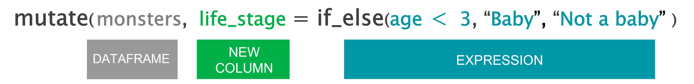
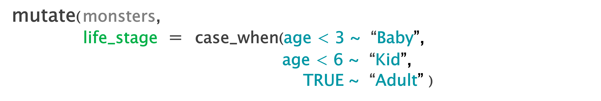

```{r setup, include=FALSE}
library(rmarkdown)
library(knitr)
library(magrittr)
library(xaringanExtra)

xaringanExtra::use_clipboard()

opts_chunk$set(error=TRUE, color=NULL, message=FALSE, eval=T)
htmltools::tagList(rmarkdown::html_dependency_font_awesome())
```

```{r xaringanExtra-freezeframe1, echo=FALSE}
xaringanExtra::use_freezeframe(trigger="click", overlay=T)
```

class: inverse, center, middle

# .big[.teal[FORKS]] 
# .bigger[in the road]

<style>
code {font-size: 1.8rem !important; line-height: 1.2 !important;}

blockquote {font-size: 1.8rem !important; line-height: 1.2 !important;}

.bump-up {margin-top: -30px}

</style>

---
class: inverse, middle, center

# .bigger[.blue[if_else( )]]


---
class: inverse
exclude: true

# How to survive

<br>

<code>
## if_else(.teal[scary], .teal["TURN   BACK   NOW!"],
##                                 .gray["KEEP  GOING."]) 
</code>

---
class: 

```{r xaringanExtra-freezeframe, echo=FALSE}
xaringanExtra::use_freezeframe(trigger="click", overlay=T)
```

<div style="width: 137%; margin-left: -140px; margin-top: -70px;">

<label class="clicktogif" title="click to play">
<input type="checkbox">

</label>
</div>

---
class: 
exclude: true

<div style="width: 137%; margin-left: -140px; margin-top: -70px;">


</div>


---
class: 
exclude: true

<div style="width: 137%; margin-left: -140px; margin-top: -70px;">


</div>

---
class: inverse

# How to survive


---
class: 
exclude: true

# How to survive


.small[.darkgray[.bottom-right[

**NOTE:** Also listen to the worm if you are in a Labyrinth.
]]]


---

# Monster bakers


---
class: center, middle

<div style="height: 120px; overflow:hidden;">

</div>


---
class: center, middle

<div style="height: 128px; overflow:hidden; margin-top: 30px;">

</div>


---
class: center, middle

<div style="height: 170px; overflow:hidden;">

</div>


---

<div style="height: 108px; overflow:hidden;">

</div>

<div style="margin-top: 81px; overflow:hidden; ">

</div>

---
class: center, middle

<div style="height: 120px; overflow: hidden; margin-top: 10px; margin-left: -24px;">

</div>


---
class: center, middle

<div style="height: 113px; margin-top: 17px; margin-left: -105px; width: 103%;">

</div>


---

<div>

</div>

<div style="overflow:hidden; width: 65.3%;">
<div style="margin-top: 24px; overflow:hidden; width: 619px;">

</div></div>

---

<div>

</div>

<div style="margin-top: 24px; overflow:hidden; ">

</div>


---
class: inverse, middle, center

# .bigger[.blue[case_when( )]]

---

# What to wear? 

--

<br><br>

```{r, eval=F}
case_when(
                  run_from_monsters  ~  "Sneakers"
                 )
```

---

# What to wear? 

<br><br>

```{r, eval=F}
case_when(
                  run_from_monsters  ~  "Sneakers",
                  swim_from_monsters  ~  "Flippers"
                 )
```


---

# What to wear?

<br><br>

```{r, eval=F}
case_when(
                  run_from_monsters  ~  "Sneakers",
                  swim_from_monsters  ~  "Flippers",
                  TRUE  ~  "Slippers"
                 )
```

---

# What to wear?

<br><br>

<style>
#wide {width: 100%;}
</style>

```{r wide, eval=F}
footwear = case_when(
                                     run_from_monsters  ~  "Sneakers",
                                     swim_from_monsters  ~  "Flippers",
                                     TRUE  ~  "Slippers"
                                    )
```

</div>

---
class: center, middle

<div style="height: 120px; overflow: hidden; margin-top: 0px; margin-left: -50px;">

</div>


---
class: center, middle

<div style="overflow: hidden; margin-top: 0px; margin-left: -20px; width: 110%;">

</div>


---
class: center, middle
exclude: true

<div style="overflow: hidden; margin-top: 0px; margin-left: -90px; width: 110%;">

</div>


---
class: center, middle

<div style="overflow: hidden; margin-top: 57px; width: 114%;">

</div>


---
class: center, middle

<div style="overflow: hidden; margin-top: 57px; width: 114%;">

</div>


---
class: center, middle

<div style="overflow: hidden; margin-top: 57px; width: 114%; margin-left: -80px;">

</div>


---
class: center, middle

<div style="overflow: hidden; margin-top: 10px; margin-left: -90px; width: 114%;">

</div>


---

<div style="height: 200px; overflow: hidden; margin-top: 10px; margin-left: -24px;">

</div>


<div style="margin-top: 20px; overflow:hidden;">

</div>

---
class: inverse, middle, center
exclude: true

# .bigger[.big[.teal[%>%]]]
# .bigger[the pipe]

---
class: inverse, center, middle


# .bigger[the pipe]

---
class: center, middle, inverse

# .bigger[.big[.teal[%>%]]]

<br>

# .bigger["and then..."]

---

# Patty cake

```{r bread1, eval=F}
patty_cake %>% 
```


---

# Patty cake

```{r bread2, eval=F}
patty_cake %>% 
* roll_it() %>% 
```

---

# Patty cake

```{r bread3, eval=F}
patty_cake %>% 
  roll_it() %>% 
* prick_it() %>% 
```

---

# Patty cake

```{r bread4, eval=F}
patty_cake %>% 
  roll_it() %>% 
  prick_it() %>% 
* mark_it(letter = "B")
```


--

.bigger[
**Read as:**
]

.bump-up[

> Take a **patty cake** (and then)   
>     roll it (and then)   
>     prick it (and then)   
>     mark it - with the letter "B".  

]

---
exclude: true

# There is a puppy

```{r pipe, eval=F}
puppy %>% runs_outside %>% rolls_in_mud %>% barks_joyfully(times = 3)
```

### Can be read as

> There is a **puppy**,  
> And then it runs outside,  
> And then it rolls in the mud,  
> And then it barks joyfully - 3 times.  

---
class: middle, center, inverse

# .bigger[.big[.teal[%>%]]]
# your toolbox

---

**Without the pipe**
.bump-up[
```{r, eval=F}
monsters <- filter(monsters, color == "pink")
```
]


---

**Without the pipe**
.bump-up[
```{r, eval=F}
monsters <- filter(monsters, color == "pink")

monsters <- select(monsters, -hat)
```
]

---

**Without the pipe**
.bump-up[
```{r, eval=F}
monsters <- filter(monsters, color == "pink")

monsters <- select(monsters, -hat)

monsters <- mutate(monsters, is_baby = age < 3)
```
]

--

**With the pipe**
.bump-up[
```{r, eval=F}
monsters <- monsters %>%
*                     filter(., color == "pink") 
```
]


---

**Without the pipe**
.bump-up[
```{r, eval=F}
monsters <- filter(monsters, color == "pink")

monsters <- select(monsters, -hat)

monsters <- mutate(monsters, is_baby = age < 3)
```
]


**With the pipe**
.bump-up[
```{r, eval=F}
monsters <- monsters %>%
*                     filter(color == "pink") 
```
]
---

**Without the pipe**
.bump-up[
```{r, eval=F}
monsters <- filter(monsters, color == "pink")

monsters <- select(monsters, -hat)

monsters <- mutate(monsters, is_baby = age < 3)
```
]


**With the pipe**
.bump-up[
```{r, eval=F}
monsters <- monsters %>%
                      filter(color == "pink") %>%
*                     select(-hat)
```
]


---

**Without the pipe**
.bump-up[
```{r, eval=F}
monsters <- filter(monsters, color == "pink")

monsters <- select(monsters, -hat)

monsters <- mutate(monsters, is_baby = age < 3)
```
]


**With the pipe**
.bump-up[
```{r, eval=F}
monsters <- monsters %>%
                      filter(color == "pink") %>%
                      select(-hat) %>%
*                     mutate(is_baby = age < 3)
```
]

---
exclude: true


```{r, eval=F}
# Without the pipe
round(log(sum(c(10, 20, 30, 50))))

# With the pipe 
result <- c(10, 20, 30, 50) %>%
            sum() %>%
            log() %>%
            round()
```


---
class: inverse, center, middle

# <i class="fas fa-carrot" aria-hidden="true"></i> [Back to Videos](https://tidy-mn.github.io/R-camp-penguins/page/videos.html)
