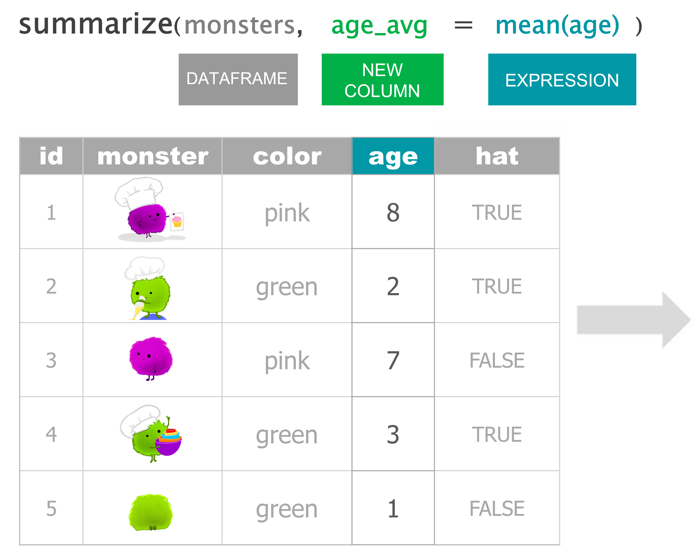
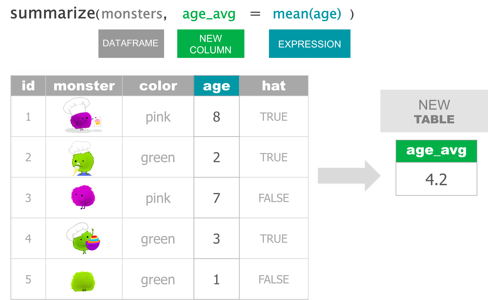
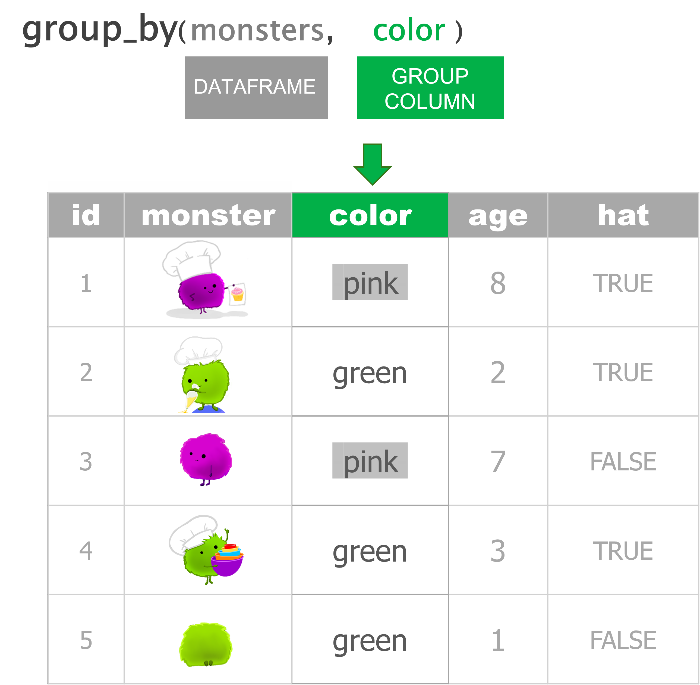
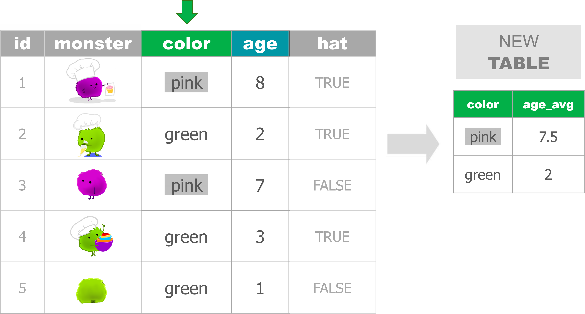
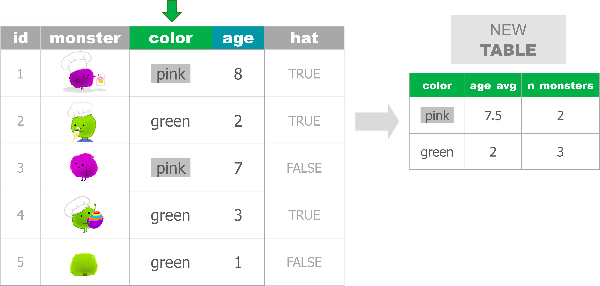

```{r setup, include=FALSE}
library(rmarkdown)
library(knitr)
library(magrittr)

xaringanExtra::use_clipboard()

opts_chunk$set(error=TRUE, color=NULL, message=FALSE, eval=T)
htmltools::tagList(rmarkdown::html_dependency_font_awesome())
```

class: center, middle, inverse

# .huge[.teal[SIMMER]] 
# it
# .big[.gray[DOWN]]


---
class: 

# <i class="fa fa-toolbox blue"></i> Your .teal[**EXPANDED**] toolbox

```{r child = '../../modules-slides/dplyr/dplyr_toolbox/expanded.Rmd', eval=T}
```


---
class:

# A .darkgray[MONSTER] summary 


---
class: inverse, middle, center

# .bigger[.blue[summarize( )]]

---

<div style="height: 145px; overflow:hidden;">

</div>

--

<div style="margin-top: 24px; overflow:hidden; ">

</div>


---

<div style="height: 145px; overflow:hidden;">

</div>

<div style="margin-top: 52px; overflow:hidden; ">

</div>


---
class: inverse, middle, center

# .bigger[.blue[group_by( )]]

---


<div style="height: 160px; overflow:hidden;">

</div>

--

<div style="margin-top: 4px; overflow:hidden; ">

</div>


---
class: inverse, middle, center

# .bigger[.blue[group_by( )]] %>%
# .bigger[.blue[summarize( )]]

---


<div style="height: 145px; overflow:hidden;">

</div>

---

<div style="height: 145px; overflow:hidden;">

</div>

---

<div style="height: 145px; overflow:hidden;">

</div>

---

<div style="height: 145px; overflow:hidden;">

</div>

--

<div style="margin-top: 0; overflow:hidden; ">

</div>


---
class: inverse, middle, center

# .bigger[.blue[Multiple]]
# .bigger[.blue[summarize( )]]


---

<div style="height: 145px; overflow:hidden;">

</div>

---

<div style="height: 170px; overflow:hidden;">

</div>

---

<div style="height: 170px; overflow:hidden;">

</div>

--

<div style="margin-top: 20px; overflow:hidden; ">

</div>


---
class: inverse, center, middle

# <i class="fas fa-carrot" aria-hidden="true"></i> [Back to Videos](https://tidy-mn.github.io/R-camp-penguins/page/videos.html)
