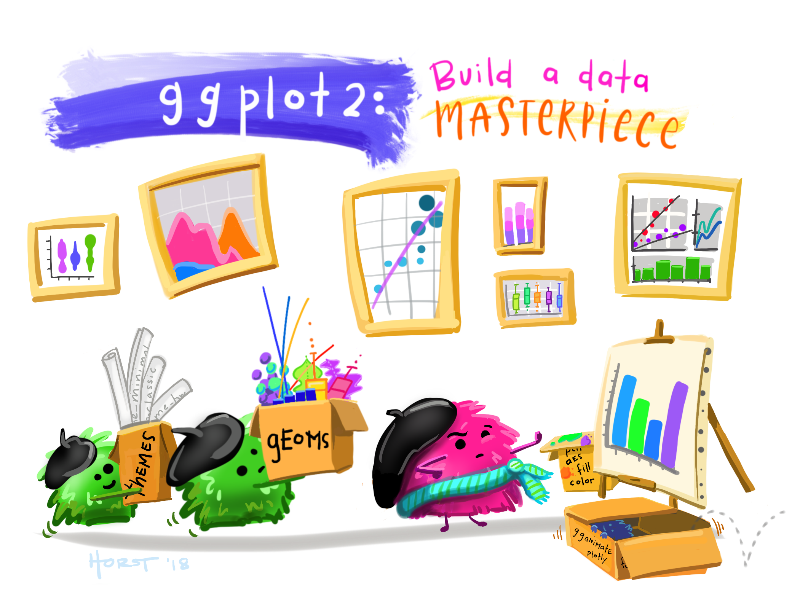

```{r setup, include=FALSE}
library(rmarkdown)
library(knitr)
library(magrittr)

xaringanExtra::use_clipboard()

opts_chunk$set(error=TRUE, color=NULL, message=FALSE, warning=FALSE, eval=T, out.height='340px', out.width='130%', dpi=220)
htmltools::tagList(rmarkdown::html_dependency_font_awesome())
```


class: middle, center, inverse

## .smaller[THE]
# .bigger[.bigger[.teal[GRAMMAR]]] .smaller[.smaller[of]] .bigger[.bigger[.teal[GRAPHICS]]]

---
class: 



.smaller[.small[.bottom-right[.gray[Artwork by @allison_horst]]]]

<style>
img {max-width: 120%; width: 100%;}
.clear {clear:both; margin-top: -20px;}
h2, h3 {color: black;}
.pull-right img {max-width: 139%; margin-left: -12px;}
.pull-left .remark-code-line {font-size: 1.49rem;}

.remark-code-line {font-size: 1.92rem;}

.small-font {font-size: 1.3rem;}
.small-font .remark-code-line {font-size: 1.3rem;}
.med-font .remark-code-line {font-size: 1.7rem;}

.shift-up {margin-top: -300px; width: 395px;}
.shift-left {margin-left: -80px;}
.shift-right {margin-left: 180px;}
.shift-down {padding-top: 12px;}

.geom1 {padding-top: 1px;}
.geom2 {margin-top: -16px;}

.remark-slide table {width: 108%; font-size: 1.4rem;}
.small-table table {width: 39%;}

.missing {font-weight: 600;}

</style>

---
class: inverse, middle, center
exclude: true

# .bigger.big[[.blue[gg]]]
# .gray[Grammar of graphics]

---
class:  middle, center
exclude: true

# .bigger[.darkpurple[
**Grammar of graphics**
]]


---
exclude: true

<br>

.pinkquote[

> The .pink[**gg**]  in `ggplot` stands for Grammar of graphics

]

???

And this grammar is a powerful tool that gives you a set of building blocks you can put together in any way you choose to build the specific chart or visualization you need.

The first building block is the plot canvas, and is the foundation that all the plot pieces build upon. 

---

.shift-left[

# Our canvas

```{r, out.height='330px'}
library(tidyverse)

ggplot()
```

]

---
class: inverse

.shift-left[
# Lost
# penguins
]

<div style="overflow: hidden; margin-left: 350px; margin-top: -305px; width: 100%;">

</div> 


--

.small-font[.shift-left[.shift-up[
```{r, eval=F}
lost_penguins <- 
  read_csv("lost_penguins.csv")
```

```{r, echo=F}
lost_penguins <- palmerpenguins::penguins
```
]]]


---

.shift-left[

# Lost penguins

<br>

```{r, echo=F}
#library(kableExtra)
missing <- 'missing'

set.seed(100)

lost_penguins <- sample_n(palmerpenguins::penguins %>% 
                            filter(species == "Gentoo", 
                                   body_mass_g > 4900), 
                          3) %>%
        mutate(species = missing, 
               island = missing, 
               sex = missing)

missing <- '<span class="missing blue">missing</span>'

knitr::kable(lost_penguins %>% 
               mutate(species = missing, 
                      island = missing, 
                      sex = missing), escape = F)
```

]

---

.shift-left[

# Our canvas for penguins

```{r, out.height='320px'}
library(tidyverse)

ggplot(lost_penguins)
```
]

---
class: inverse, middle, center

# Aesthetics 
# .bigger[.blue[aes( )]]

---

.shift-left[

# Aesthetics: .blue[aes( )]

The .blue[**X**] and .blue[**Y**] axes are assigned inside the aesthetics.

```{r, eval=F, out.height='340px'}
ggplot(lost_penguins, 
            aes(x = bill_length_mm, #<<
                   y = flipper_length_mm)) #<<
```

]

---

.shift-left[

# Aesthetics: .blue[aes( )]
]

.pull-left[
.shift-left[

```{r, eval=F}
ggplot(lost_penguins, 
               aes(x = bill_length_mm, #<<
                        y = flipper_length_mm)) #<<
```

]]

.pull-right[
```{r, echo=F, out.height='500px'}
ggplot(lost_penguins, 
            aes(x = bill_length_mm, #<<
                   y = flipper_length_mm)) +
     theme_gray(base_size = 30)
```
]

---
class: inverse, middle, center


# .bigger[.big[.blue[geoms]]]

---
exclude: true

.shift-left[

# Geoms

<br>

> Geoms add visualization of your data to the your canvas. They are the really juicy fillings in your ggplot sandwhich. You can add one or multiple geoms. 

]

---

.shift-left[

# .blue[geom_point( )]

```{r, eval=F}
ggplot(lost_penguins, 
            aes(x = bill_length_mm, 
                   y = flipper_length_mm)) +
   geom_point() #<<
```

]

---

.shift-left[

# .blue[geom_point( )]
]

.pull-left[
.shift-left[

```{r, eval=F}
ggplot(lost_penguins, 
               aes(x = bill_length_mm, 
                        y = flipper_length_mm)) +
   geom_point() #<<
```

]]

.pull-right[
```{r, echo=F, out.height='500px'}
ggplot(lost_penguins, 
         aes(x = bill_length_mm, 
             y = flipper_length_mm)) +
  geom_point()  +
  theme_gray(base_size = 30)
```

]

---

.shift-left[

# .blue[geom_point(] size = BIGGER .blue[)] 

]

.pull-left[
.shift-left[

```{r, eval=F}
ggplot(lost_penguins, 
               aes(x = bill_length_mm,
                        y = flipper_length_mm)) +
   geom_point(size = 10) #<<
```


]]

.pull-right[
```{r, echo=F, out.height='500px'}
ggplot(lost_penguins, 
       aes(x = bill_length_mm,
           y = flipper_length_mm)) +
   geom_point(size = 10) +
   theme_gray(base_size = 30)
```

]


---

.shift-left[

# All together now

```{r, echo=F, out.width="64%", out.height="480px"}
ggplot(lost_penguins, 
       aes(x = bill_length_mm, 
           y = flipper_length_mm)) +
  geom_point(size = 10) +
   theme_gray(base_size = 30)
```
]

---

.shift-left[

# All together now

```{r}
library(palmerpenguins)

penguins <- penguins

penguins <- penguins %>% 
            filter(species != "Gentoo" |
                     !body_mass_g %in% lost_penguins$body_mass_g |
                     !flipper_length_mm %in% lost_penguins$flipper_length_mm |
                     !bill_length_mm %in% lost_penguins$bill_length_mm)

all_penguins <- bind_rows(penguins, lost_penguins)
```
]

---

.shift-left[

# All together now

```{r, eval=F}
ggplot(all_penguins, #<< 
           aes(x = bill_length_mm,
                  y = flipper_length_mm)) +
   geom_point(size = 10) 
```
]

---

.shift-left[

# All together now

]

.pull-left[
.shift-left[

```{r, eval=F}
ggplot(all_penguins, #<< 
               aes(x = bill_length_mm,
                        y = flipper_length_mm)) +
   geom_point(size = 10)
```


]]

.pull-right[
```{r, echo=F, out.height='500px'}
ggplot(all_penguins, 
               aes(x = bill_length_mm,
                        y = flipper_length_mm)) +
   geom_point(size = 10) +
   theme_gray(base_size = 24)
```

]

---

.shift-left[

# Colors

```{r, eval=F}
ggplot(all_penguins, 
            aes(x = bill_length_mm,
                    y = flipper_length_mm)) +
   geom_point(aes(color = species),  #<<
                   size = 10)
```

]

---

.shift-left[

# Colors

]

.pull-left[
.shift-left[

```{r, eval=F}
ggplot(all_penguins, 
              aes(x = bill_length_mm,
                       y = flipper_length_mm)) +
   geom_point(aes(color = species),  #<<
                            size = 10)
```


]]

.pull-right[
```{r, echo=F, out.height='500px'}
ggplot(all_penguins, 
            aes(x = bill_length_mm,
                    y = flipper_length_mm)) +
   geom_point(aes(color = species),  
                   size = 7) +
   theme_gray(base_size = 22)
```

]


---

.shift-left[

# Colors

```{r, eval=F}
ggplot(all_penguins, 
            aes(x = species, #<<
                   y = flipper_length_mm)) +
   geom_point(aes(color = species),  
                       size = 10)
```
]

---

.shift-left[

# Colors

]

.pull-left[
.shift-left[

```{r, eval=F}
ggplot(all_penguins, 
               aes(x = species, #<<
                        y = flipper_length_mm)) +
   geom_point(aes(color = species),  
                            size = 10)
```

]]

.pull-right[
```{r, echo=F, out.height='500px'}
ggplot(all_penguins, 
        aes(x = species, 
            y = flipper_length_mm))  +
  geom_point(aes(color = species), 
             size = 7) +
   theme_gray(base_size = 18)
```

]


---

.shift-left[
.bluecode[

# More `geom_`'s

]

```{r, eval=F, echo=F}
#.clear[
# 
#`geom_point`  
#Scatterplot of each x-y pair  
#]
```


.geom1[.geom2[
geom_line( )
]]  

.clear[

.geom1[.geom2[
geom_area( )
]]]

.clear[

.geom1[.geom2[
geom_col( )
]]]

.clear[

.geom1[.geom2[
geom_boxplot( )
]]]

.clear[

.geom1[.geom2[
geom_histogram( )
]]]
]

---
.shift-left[

# .blue[geom_text( )]

```{r, eval=F}
ggplot(all_penguins, 
            aes(x = bill_length_mm, 
                   y = flipper_length_mm))  +
  geom_point(aes(color = species), size = 10) +
  geom_text(aes(label = species)) #<<
```
]

---

.shift-left[

# .blue[geom_text( )]

```{r, echo=F, out.height=NULL, out.width=NULL, fig.width=10, fig.height=5}
ggplot(all_penguins, 
        aes(x = bill_length_mm, 
            y = flipper_length_mm))  +
  geom_point(aes(color = species), size = 10) +
  geom_text(aes(label = species), size = 2.5) +
  theme_gray(base_size = 18)
```

]

---

.shift-left[

# Mean flipper lengths

.med-font[
```{r}
flipper_lengths <- all_penguins %>%
                     group_by(species) %>%
                     summarize(flipper_avg = 
                                  mean(flipper_length_mm, na.rm = T))

```
]

<br>

.small-table[
```{r, echo=F}
kable(flipper_lengths)
```
]
]

---

.shift-left[

# Mean flipper lengths

]

.pull-left[
.shift-left[

```{r, eval=F}
ggplot(flipper_lengths, 
       aes(x = species,
           y = flipper_avg))  +
  geom_col(aes(fill = species)) 
```
]]

.pull-right[

```{r, echo=F, out.height='500px'}
ggplot(flipper_lengths, 
       aes(x = species,
           y = flipper_avg))  +
  geom_col(aes(fill = species))  +
     theme_gray(base_size = 18)
```
]

---
class: inverse, middle, center

# .bigger[.blue[labs( )]]


---
class: inverse, middle, center

# .bigger[.blue[facet_wrap( )]]


---
class: inverse, middle, center

# Legends and scales
# .bigger[.blue[scale_( )]]


---

# Legends and scales

- Hide a legend
- Use a color theme
- Use a single color


---
class: inverse, middle, center

# .bigger[.blue[theme( )]]


---
class: inverse, center, middle

# <i class="fas fa-carrot" aria-hidden="true"></i> [Back to Videos](https://tidy-mn.github.io/R-camp-penguins/page/videos.html)


```{r, echo=F, eval=F}

geoms <- tibble::tribble(
~geom,                    ~desription, 
"<code>geom_point</code>","Scatterplot of each x-y pair",
"<code>geom_line</code>","A column or barplot of each data point",
"<code>geom_area</code>","A column or barplot of each data point",
"<code>geom_col</code>","A column or barplot of each data point",
"<code>geom_boxplot</code>","A column or barplot of each data point",
"<code>geom_histogram</code>","A column or barplot of each data point"
)

knitr::kable(geoms)
```
