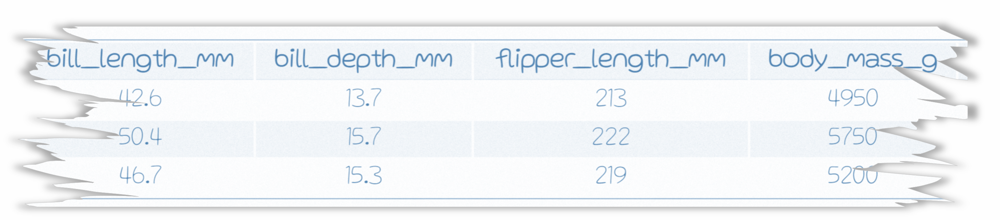
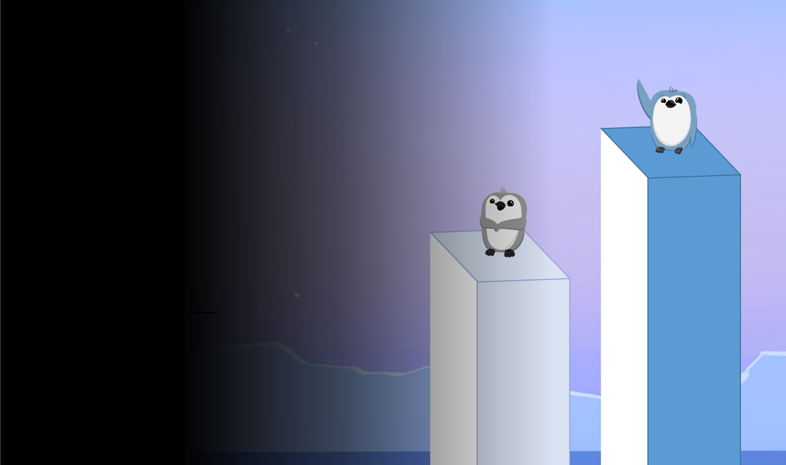

```{r setup, include=FALSE}
library(rmarkdown)
library(knitr)
library(magrittr)

xaringanExtra::use_clipboard()

#out.height='340px', out.width='130%',

opts_chunk$set(error=TRUE, color=NULL, message=FALSE, warning=FALSE, eval=T, fig.width=6, dpi=220)
htmltools::tagList(rmarkdown::html_dependency_font_awesome())
```


class: middle, center, inverse

# .bigger[.bigger[.teal[GRAMMAR]]] .smaller[.smaller[of]] .bigger[.bigger[.teal[GRAPHICS]]]

---
class: 


.smaller[.small[.bottom-right[.gray[Artwork by @allison_horst]]]]

<style>
.wider {width: 107%;}
img {max-width: 120%; width: 100%;}
.clear {clear:both; margin-top: -20px;}
h2, h3 {color: black;}

.pull-right img {width: 139%;
    max-width: 139%;
    margin-left: -38px;
    margin-top: -20px;}
    
.pull-left .remark-code-line {font-size: 1.49rem;}
.pull-up {margin-top: -28px;}

.remark-code-line {font-size: 1.92rem;}

.small-font {font-size: 1.3rem;}
.small-font .remark-code-line {font-size: 1.3rem;}
.med-font .remark-code-line {font-size: 1.7rem;}

.shift-up {z-index: 99; position: absolute; top: 168px; left: 52px; width: 602px;}
.shift-left {margin-left: -80px;}
.shift-right {margin-left: 180px;}
.shift-down {padding-top: 12px;}

.geom1 {padding-top: 1px;}
.geom2 {margin-top: -16px;}

.remark-slide table {width: 108%; font-size: 1.4rem;}
.small-table table {width: 39%;}

.missing {font-weight: 600;}

</style>

---
class: inverse, middle, center
exclude: true

# .bigger.big[[.blue[gg]]]
# .gray[Grammar of graphics]

---
class:  middle, center
exclude: true

# .bigger[.darkpurple[
**Grammar of graphics**
]]


---
exclude: true

<br>

.pinkquote[

> The .pink[**gg**]  in `ggplot` stands for Grammar of graphics

]

???

And this grammar is a powerful tool that gives you a set of building blocks you can piece together in any way you choose to build the specific chart of your dreams. 

The first building block is the plot canvas, and it is the foundation for all the other plot pieces. 

---

.shift-left[

# .teal[ggplot canvas]

```{r, out.height='330px'}
library(tidyverse)

ggplot()
```

]


---
class:

.shift-left[
# Lost penguins
]

<br>

<div style="overflow: hidden; width: 93%;">

</div> 


---
class: inverse


<div style="overflow: hidden; width: 100%; position: absolute; top: 0; left:0; float: left;">

</div> 


.shift-left[

# Lost penguins
]


.small-font[.shift-up[.whitecode[

```{r, eval=F}
lost_penguins <- read_csv("torn_penguins.csv")
```

```{r, echo=F}
lost_penguins <- read_csv("https://tidy-mn.github.io/R-camp-penguins/data/torn_penguins.csv")

#lost_penguins <- .teal[read_csv(]"torn_penguins.csv".teal[)]]]

```
]]]

.bottom-right[.off-white[Penguins illustrated by @allison_horst]]


---
class: inverse
exclude: true

.shift-left[
# Lost
# penguins
]

<div style="overflow: hidden; margin-left: 350px; margin-top: -305px; width: 100%;">

</div> 


.small-font[.shift-left[.shift-up[.whitecode[
```{r, eval=F}
lost_penguins <- read_csv("torn_penguins.csv")
```

]]]]


---
exclude: true

.shift-left[

# Lost penguins

<br>

<style>
@import url('https://fonts.googleapis.com/css2?family=Kalam:wght@300&family=Source+Sans+3:wght@300;500;600;700&display=swap');

@import url('https://fonts.googleapis.com/css2?family=Gluten:wght@100&family=Kalam:wght@300&family=Source+Sans+3:wght@300;500;600;700&display=swap');

.hand {font-family: 'Kalam', cursive; font-weight: 300;}
.hand table {font-family: 'Kalam', cursive;}

.hand {font-family: 'Gluten', cursive; font-weight: 100;}
.hand table {font-family: 'Gluten', cursive;}
</style>

.hand[

```{r, echo=F}
#library(kableExtra)
missing <- 'missing'

set.seed(100)

lost_penguins <- sample_n(palmerpenguins::penguins %>% 
                            filter(species == "Gentoo", 
                                   body_mass_g > 4900), 
                          3) %>%
        mutate(species = missing, 
               island = missing)

missing <- '<span class="missing blue">missing</span>'

knitr::kable(lost_penguins %>% 
               mutate(species = missing, 
                      island = missing), 
             align = 'c',
             escape = F)
```
]
]

---

.shift-left[

# .teal[ggplot canvas] .smaller[(with penguins)]

```{r, out.height='330px'}
library(tidyverse)

ggplot(lost_penguins)
```
]

---
class: inverse, middle, center

# .bigger[.big[.blue[aes( )]]]
# aesthetics 

---

.shift-left[

# .blue[aes( )]

Assign the .blue[**X**] and .blue[**Y**] axes inside the aesthetics.

```{r, eval=F}
ggplot(lost_penguins, 
            aes(x = bill_length_mm, #<<
                   y = flipper_length_mm)) #<<
```

]

---

.shift-left[

# .blue[aes( )]
]

.pull-left[
.shift-left[

```{r, eval=F}
ggplot(lost_penguins, 
               aes(x = bill_length_mm, #<<
                        y = flipper_length_mm)) #<<
```

]]

.pull-right[
```{r, echo=F, out.height='500px'}
ggplot(lost_penguins, 
            aes(x = bill_length_mm, 
                   y = flipper_length_mm)) +
     theme_gray(base_size = 30)
```
]

---
class: inverse, middle, center


# .bigger[.big[.blue[geoms]]]

---
exclude: true

.shift-left[

# Geoms

<br>

> Geoms add visualization of your data to the your canvas. They are the really juicy fillings in your ggplot sandwhich. You can add one or multiple geoms. 

]

---

.shift-left[

# .blue[geom_point( )]

```{r, eval=F}
ggplot(lost_penguins, 
            aes(x = bill_length_mm, 
                   y = flipper_length_mm)) +
   geom_point() #<<
```

]

---

.shift-left[

# .blue[geom_point( )]
]

.pull-left[
.shift-left[

```{r, eval=F}
ggplot(lost_penguins, 
               aes(x = bill_length_mm, 
                        y = flipper_length_mm)) +
   geom_point() #<<
```

]]

.pull-right[
```{r, echo=F, out.height='500px'}
ggplot(lost_penguins, 
         aes(x = bill_length_mm, 
             y = flipper_length_mm)) +
  geom_point()  +
  theme_gray(base_size = 30)
```

]

---

.shift-left[

# .blue[geom_point(] size = HUGE .blue[)] 

]

.pull-left[
.shift-left[

```{r, eval=F}
ggplot(lost_penguins, 
               aes(x = bill_length_mm,
                        y = flipper_length_mm)) +
   geom_point(size = 10) #<<
```


]]

.pull-right[
```{r, echo=F, out.height='500px'}
ggplot(lost_penguins, 
       aes(x = bill_length_mm,
           y = flipper_length_mm)) +
   geom_point(size = 10) +
   theme_gray(base_size = 30)
```

]


---

.shift-left[

# All together now

```{r, echo=F, fig.width=14}
ggplot(lost_penguins, 
       aes(x = bill_length_mm, 
           y = flipper_length_mm)) +
  geom_point(size = 10) +
   theme_gray(base_size = 27)
```
]

---

.shift-left[

# All together now

```{r, eval=F}
good_penguins <- read_csv("untorn_penguins.csv")

all_penguins <- bind_rows(good_penguins, 
                                            lost_penguins)
```

```{r, echo=F}
good_penguins <- read_csv("https://tidy-mn.github.io/R-camp-penguins/data/untorn_penguins.csv")

all_penguins <- bind_rows(good_penguins, 
                          lost_penguins)
```
]

---

.shift-left[

# All together now

```{r, eval=F}
ggplot(all_penguins, #<< 
           aes(x = bill_length_mm,
                  y = flipper_length_mm)) +
   geom_point(size = 10) 
```
]


---

.shift-left[

# All together now

]

.pull-left[
.shift-left[

```{r, eval=F}
ggplot(all_penguins, #<< 
                aes(x = bill_length_mm,
                         y = flipper_length_mm)) +
   geom_point(size = 10)
```


]]

.pull-right[
```{r, echo=F, out.height='500px'}
ggplot(all_penguins, 
               aes(x = bill_length_mm,
                        y = flipper_length_mm)) +
   geom_point(size = 10) +
   theme_gray(base_size = 27)
```

]


---

.shift-left[

# All together now

]

.pull-left[
.shift-left[

```{r, eval=F}
ggplot(all_penguins, 
                aes(x = bill_length_mm,
                         y = flipper_length_mm)) +
   geom_point(size = 10, 
                            alpha = 0.25) #<<
```


]]

.pull-right[
```{r, echo=F, out.height='500px'}
ggplot(all_penguins, 
               aes(x = bill_length_mm,
                        y = flipper_length_mm)) +
   geom_point(size = 10, alpha = 0.25) +
   theme_gray(base_size = 27)
```

]


---

.shift-left[

# Colors

```{r, eval=F}
ggplot(all_penguins, 
            aes(x = bill_length_mm,
                   y = flipper_length_mm)) +
   geom_point(aes(color = species),  #<<
                       size = 10, 
                       alpha = 0.25)
```

]

---

.shift-left[

# Colors

]

.pull-left[
.shift-left[

```{r, eval=F}
ggplot(all_penguins, 
              aes(x = bill_length_mm,
                       y = flipper_length_mm)) +
   geom_point(aes(color = species),  #<<
                            size = 10,
                            alpha = 0.25)
```


]]

.pull-right[
```{r, echo=F, out.height='500px'}
ggplot(all_penguins, 
            aes(x = bill_length_mm,
                    y = flipper_length_mm)) +
   geom_point(aes(color = species),  
                   size = 7, alpha = 0.35) +
   theme_gray(base_size = 22)
```
]


---

.shift-left[

# Colors

```{r, eval=F}
ggplot(all_penguins, 
            aes(x = species, #<<
                   y = flipper_length_mm)) +
   geom_point(aes(color = species),  
                       size = 10,
                       alpha = 0.25)
```
]

---

.shift-left[

# Colors

]

.pull-left[
.shift-left[

```{r, eval=F}
ggplot(all_penguins, 
               aes(x = species, #<<
                        y = flipper_length_mm)) +
   geom_point(aes(color = species),  
                            size = 10, 
                            alpha = 0.25)
```

]]

.pull-right[.pull-up[
```{r, echo=F, fig.width=10, fig.height=9}
ggplot(all_penguins, 
        aes(x = species, 
            y = flipper_length_mm))  +
  geom_point(aes(color = species), 
             size = 7, alpha = 0.35) +
   theme_gray(base_size = 24)
```
]
]


---

.shift-left[
.bluecode[

# `geom_***`

]

```{r, eval=F, echo=F}
#.clear[
# 
#`geom_point`  
#Scatterplot of each x-y pair  
#]
```


.geom1[.geom2[
geom_line( )
]]  

.clear[

.geom1[.geom2[
geom_area( )
]]]

.clear[

.geom1[.geom2[
geom_col( )
]]]

.clear[

.geom1[.geom2[
geom_boxplot( )
]]]

.clear[

.geom1[.geom2[
geom_histogram( )
]]]
]

---

.shift-left[

# .blue[geom_text( )]

.wider[

```{r, eval=F}
ggplot(all_penguins, 
            aes(x = bill_length_mm, 
                   y = flipper_length_mm))  +
  geom_point(aes(color = species), size = 10, alpha = 0.25) +
  geom_text(aes(label = species)) #<<
```

]
]

---

.shift-left[

# .blue[geom_text( )]

```{r, echo=F, fig.width=10, fig.height=5}
ggplot(all_penguins, 
        aes(x = bill_length_mm, 
            y = flipper_length_mm))  +
  geom_point(aes(color = species), size = 10, alpha = 0.3) +
  geom_text(aes(label = species), size = 2.5) +
  theme_gray(base_size = 18)
```

]


---
class: inverse, middle, center


# .bigger[.big[.blue[lims]]]

---

.shift-left[

# .blue[lims( )]

.wider[
```{r, eval=F}
ggplot(all_penguins, 
            aes(x = bill_length_mm, 
                   y = flipper_length_mm))  +
  geom_point(aes(color = species), size = 10, alpha = 0.25) +
  geom_text(aes(label = species)) +
  lims(x = c(40, 55), #<< 
           y = c(200, 225)) #<<
```
]
]

---

.shift-left[

# .blue[lims( )]

```{r, echo=F, fig.width=10, fig.height=5}
ggplot(all_penguins, 
        aes(x = bill_length_mm, 
            y = flipper_length_mm))  +
  geom_point(aes(color = species), size = 10, alpha = 0.35) +
  geom_text(aes(label = species), size = 2.5) +
  lims(x = c(40, 55), y = c(200, 225)) + 
  theme_gray(base_size = 18)
```

]

---
class: middle, center, inverse

# .bigger[.bigger[❤️]]
# .bigger[.teal[Code] .teal[magic]]


---

.shift-left[

# Compare ~~species~~ .teal[islands]
]

--

.shift-left[.wider[
```{r, eval=F}
ggplot(all_penguins, 
            aes(x = bill_length_mm, 
                   y = flipper_length_mm))  +
  geom_point(aes(`color = island`), size = 10, alpha = 0.25) + 
  geom_text(aes(`label = island`)) +  
  lims(x = c(40, 55), 
           y = c(200, 225)) 
```
]
]

---

.shift-left[

# Compare .teal[islands]

```{r, echo=F, fig.width=10, fig.height=5}
ggplot(all_penguins, 
        aes(x = bill_length_mm, 
            y = flipper_length_mm))  +
  geom_point(aes(color = island), size = 10, alpha = 0.35) +
  geom_text(aes(label = island), size = 2.5) +
  lims(x = c(40, 55), y = c(200, 225)) + 
  theme_gray(base_size = 18)
```

]

---
class: inverse, center, middle

# <i class="fas fa-carrot" aria-hidden="true"></i> [Back to Videos](https://tidy-mn.github.io/R-camp-penguins/index.html)


```{r, echo=F, eval=F}

geoms <- tibble::tribble(
~geom,                    ~desription, 
"<code>geom_point</code>","Scatterplot of each x-y pair",
"<code>geom_line</code>","A column or barplot of each data point",
"<code>geom_area</code>","A column or barplot of each data point",
"<code>geom_col</code>","A column or barplot of each data point",
"<code>geom_boxplot</code>","A column or barplot of each data point",
"<code>geom_histogram</code>","A column or barplot of each data point"
)

knitr::kable(geoms)
```
