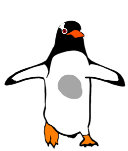

```{r setup, include=FALSE}
library(rmarkdown)
library(knitr)
library(tidyverse)

xaringanExtra::use_clipboard()

opts_chunk$set(error=TRUE, color=NULL, message=FALSE, warning=FALSE, eval=T, dpi=230)
htmltools::tagList(rmarkdown::html_dependency_font_awesome())
```

```{r xaringanExtra-freezeframe1, echo=FALSE}
xaringanExtra::use_freezeframe(trigger="none", overlay=T)
```

```{r xaringan-animate-css, echo=FALSE}
xaringanExtra::use_animate_css()
```

class: middle, center, inverse

.shift-up[
## .smaller[PLOTS]
# .bigger[.bigger[.teal[FOR REAL]]]
]

<style>
.bigchart {margin-top: -10px; margin-left: -5%; width: 110%;}
.wider {width: 107%;}
img {max-width: 120%; width: 100%;}
.clear {clear:both;}
h2, h3 {color: black;}

.pull-right img {width: 139%;
    max-width: 139%;
    margin-left: -38px;
    margin-top: -20px;}
    
.pull-left .remark-code-line {font-size: 1.49rem;}
.pull-up {margin-top: -28px;}

.small-font {font-size: 1.5rem;}
.small-font .remark-code-line {font-size: 1.5rem;}
.med-font .remark-code-line {font-size: 1.7rem;}

.shift-up {margin-top: -20px;}
.shift-left {margin-left: -100px;}
.small-shift-left {margin-left: -60px;}
.shift-right {margin-left: 180px;}
.shift-down {padding-top: 12px;}

.remark-slide table {width: 108%; font-size: 1.4rem;}
.small-table table {width: 39%;}

.remark-code-line {font-size: 1.78rem; line-height: 1.37;}

</style>

--

<div class="ticker-container">
<div class="ticker-wrapper">
<div class="ticker-transition">
<div class="ticker-item">...BREAKING NEWS...</div>
<div class="ticker-item">..Penguins at it again...</div>
<div class="ticker-item">..BREAKING NEWS...</div>
<div class="ticker-item">..So BIG growth rate expected to exceed...</div>
<div class="ticker-item">...BREAKING NEWS...</div>
<div class="ticker-item">..Penguins growing and growing...</div>
<div class="ticker-item">...BREAKING NEWS....</div>
</div>
</div>
</div>
  
---
class: middle, center, inverse
exclude: true

## .smaller[GGPLOTS]
# .bigger[.bigger[.teal[FOR REAL]]]


<h1 style="text-wrap: nowrap; margin-left: -153px; position: absolute;"> S....BREAKING NEWS....BREAKING NEWS....BREAKI...</h1>

---
class: animated infinite pulse


---


---
class: middle, center 

> .shift-left[# .bigger[“]The penguins are growing....bigger[”]]
> .small-shift-left[### .darkgray[.small[*- The R/V Topsy-Scurvy*]]]




---
class: middle, center, gray-bg

```{r, echo=F}
rv_penguins <- read_csv("../../2007-2009_RV_scurvy_penguins.csv")
```

.shift-up[
```{r news-plot, echo=F, fig.width=12, fig.height=7}
library(tidyverse)
library(ggthemes)

# Bill length trends
mean_bill_lengths <- rv_penguins %>%
                     group_by(year) %>%
                     filter(!is.na(year)) %>%
                     summarize(avg_bill_length = mean(bill_length_mm, na.rm = T))

# News plot
ggplot(mean_bill_lengths,
       aes(x = year, y = avg_bill_length)) +
  geom_col(aes(fill = year), show.legend = FALSE) +
  #geom_line(size = 3, color = "tomato", linetype = "dotted") +
  #geom_point(color = "tomato", size = 3) +
  geom_line(size = 2, color = "tomato", arrow = arrow()) +
  coord_cartesian(ylim = c(43.7, 47.2)) +
  #lims(y = c(43, 47.3)) +
  labs(title = "\nPenguin growth nears speed of light",
       subtitle = "Mean bill length in mm\n",
       caption = "\n©2023 The R/V Topsy-Scurvy") +
  theme_wsj(base_size = 16, color = "gray")
```
]

---

###  > .bluecode[`growth_plot.R`]

```{r, eval=F, fig.width=12, fig.height=7}
library(tidyverse)
library(ggthemes)

# News plot
ggplot(mean_bill_lengths, 
       aes(x = year, y = avg_bill_length)) +
  geom_col(aes(fill = year), show.legend = FALSE) +
  geom_line(size = 2, color = "tomato", arrow = arrow()) +
  coord_cartesian(ylim = c(43.7, 47.2)) +
  labs(title = "Penguin growth nears speed of light",
       subtitle = "Mean bill length in mm\n",
       caption = "©2023 The R/V Topsy-Scurvy") +
  theme_wsj(color = "gray")
```

---

###  Y-axes limits

```{r, eval=F, fig.width=12, fig.height=7}
library(tidyverse)
library(ggthemes)

# News plot
ggplot(mean_bill_lengths, 
       aes(x = year, y = avg_bill_length)) +
  geom_col(aes(fill = year), show.legend = FALSE) +
  geom_line(size = 2, color = "tomato", arrow = arrow()) +
  coord_cartesian(ylim = c(43.7, 47.2)) + #<<
  labs(title = "Penguin growth nears speed of light",
       subtitle = "Mean bill length in mm\n",
       caption = "©2023 The R/V Topsy-Scurvy") +
  theme_wsj(color = "gray")
```

---

###  Y-axes limits

```{r, eval=F, fig.width=12, fig.height=7}
library(tidyverse)
library(ggthemes)

# News plot
ggplot(mean_bill_lengths, 
       aes(x = year, y = avg_bill_length)) +
  geom_col(aes(fill = year), show.legend = FALSE) +
  geom_line(size = 2, color = "tomato", arrow = arrow()) +
  coord_cartesian(ylim = c(`0`, 47.2)) +
  labs(title = "Penguin growth nears speed of light",
       subtitle = "Mean bill length in mm\n",
       caption = "©2023 The R/V Topsy-Scurvy") +
  theme_wsj(color = "gray")
```

---

```{r chunk-a, echo=F, eval=T, fig.width=12, fig.height=7, ref.label=c('news-plot')}
```


---

.shift-up[
### .teal[Start Y-axes at ZERO]
]

```{r, echo=F, fig.width=12, fig.height=7}
library(tidyverse)
library(ggthemes)

# News plot
ggplot(mean_bill_lengths, 
       aes(x = year, y = avg_bill_length)) +
  geom_col(aes(fill = year), show.legend = FALSE) +
  geom_line(size = 2, color = "tomato", arrow = arrow()) +
  coord_cartesian(ylim = c(0, 47.2)) +
  labs(title = "Penguin growth nears speed of light",
       subtitle = "Mean bill length in mm\n",
       caption = "©2023 The R/V Topsy-Scurvy") +
  theme_wsj(color = "gray")
```


---

###  geom_line **->**

```{r, eval=F}
library(tidyverse)
library(ggthemes)

# News plot
ggplot(mean_bill_lengths, 
       aes(x = year, y = avg_bill_length)) +
  geom_col(aes(fill = year), show.legend = FALSE) +
  geom_line(size = 2, color = "tomato", arrow = arrow()) + #<<
  coord_cartesian(ylim = c(0, 47.2)) +
  labs(title = "Penguin growth nears speed of light",
       subtitle = "Mean bill length in mm\n",
       caption = "©2023 The R/V Topsy-Scurvy") +
  theme_wsj(color = "gray")
```

---

###  geom_line **->**

```{r, eval=F}
library(tidyverse)
library(ggthemes)

# News plot
ggplot(mean_bill_lengths, 
       aes(x = year, y = avg_bill_length)) +
  geom_col(aes(fill = year), show.legend = FALSE) +
                                                    #<<
  coord_cartesian(ylim = c(0, 47.2)) +
  labs(title = "Penguin growth nears speed of light",
       subtitle = "Mean bill length in mm\n",
       caption = "©2023 The R/V Topsy-Scurvy") +
  theme_wsj(color = "gray")
```


---

.shift-up[
### .teal[Hold the line]
]

```{r, echo=F, fig.width=12, fig.height=7}
library(tidyverse)
library(ggthemes)

# News plot
ggplot(mean_bill_lengths, 
       aes(x = year, y = avg_bill_length)) +
  geom_col(aes(fill = year), show.legend = FALSE) +
  #geom_line(size = 2, color = "tomato", arrow = arrow()) +
  coord_cartesian(ylim = c(0, 47.2)) +
  labs(title = "Penguin growth nears speed of light", 
       subtitle = "Mean bill length in mm\n",
       caption = "©2023 The R/V Topsy-Scurvy") +
  theme_wsj(color = "gray")
```


---
class: inverse, middle, center

# .bigger[.blue[labs( )]]

---

###  Title and labels

```{r, eval=F}
library(tidyverse)
library(ggthemes)

# News plot
ggplot(mean_bill_lengths, 
       aes(x = year, y = avg_bill_length)) +
  geom_col(aes(fill = year), show.legend = FALSE) +
  coord_cartesian(ylim = c(0, 47.2)) +
  labs(title = "Penguin growth nears speed of light",  #<<
       subtitle = "Mean bill length in mm\n",  #<<
       caption = "©2023 The R/V Topsy-Scurvy") +  #<<
  theme_wsj(color = "gray")
```

---

###  Title and labels

```{r, eval=F}
library(tidyverse)
library(ggthemes)

# News plot
ggplot(mean_bill_lengths, 
       aes(x = year, y = avg_bill_length)) +
  geom_col(aes(fill = year), show.legend = FALSE) +
  coord_cartesian(ylim = c(0, 47.2)) +
  labs(title = "Penguin bill lengths by year",  #<<
       subtitle = "Mean bill length in mm\n",
       caption = "©2023 The R/V Topsy-Scurvy") +
  theme_wsj(color = "gray")
```


---

###  Title and labels

```{r, eval=F}
library(tidyverse)
library(ggthemes)

# News plot
ggplot(mean_bill_lengths, 
       aes(x = year, y = avg_bill_length)) +
  geom_col(aes(fill = year), show.legend = FALSE) +
  coord_cartesian(ylim = c(0, 47.2)) +
  labs(title = "Penguin bill lengths by year",  
       subtitle = "Mean bill length in millimeters (mm)\n", #<<
       caption = "©2023 The R/V Topsy-Scurvy") +
  theme_wsj(color = "gray")
```


---

###  Title and labels

```{r, eval=F}
library(tidyverse)
library(ggthemes)

# News plot
ggplot(mean_bill_lengths, 
       aes(x = year, y = avg_bill_length)) +
  geom_col(aes(fill = year), show.legend = FALSE) +
  coord_cartesian(ylim = c(0, 47.2)) +
  labs(title = "Penguin bill lengths by year",  
       subtitle = "Mean bill length in millimeters (mm)\n", 
       caption = "©2023 The R/V Topsy-Scurvy") + #<<
  theme_wsj(color = "gray")
```

---

###  Title and labels

```{r, eval=F}
library(tidyverse)
library(ggthemes)

# News plot
ggplot(mean_bill_lengths, 
       aes(x = year, y = avg_bill_length)) +
  geom_col(aes(fill = year), show.legend = FALSE) +
  coord_cartesian(ylim = c(0, 47.2)) +
  labs(title = "Penguin bill lengths by year",  
       subtitle = "Mean bill length in millimeters (mm)\n", 
       caption = "©2023 The R/V Topsy-Scurvy",
       x = "Year") + #<<
  theme_wsj(color = "gray")
```

---

###  Title and labels

```{r, eval=F}
library(tidyverse)
library(ggthemes)

# News plot
ggplot(mean_bill_lengths, 
       aes(x = year, y = avg_bill_length)) +
  geom_col(aes(fill = year), show.legend = FALSE) +
  coord_cartesian(ylim = c(0, 47.2)) +
  labs(title = "Penguin bill lengths by year",  
       subtitle = "Mean bill length in millimeters (mm)\n", 
       caption = "©2023 The R/V Topsy-Scurvy",
       x = "Year",
       y = "Mean bill length (mm)") + #<<
  theme_wsj(color = "gray")
```

---

.shift-up[
### .teal[With less ~~EXAGGERATION~~]
]

```{r, echo=F, fig.width=12, fig.height=7}
library(tidyverse)
library(ggthemes)

# News plot
ggplot(mean_bill_lengths, 
       aes(x = year, y = avg_bill_length)) +
  geom_col(aes(fill = year), show.legend = FALSE) +
  coord_cartesian(ylim = c(0, 47.2)) +
  labs(title = "Penguin bill lengths by year",  
       subtitle = "Mean bill length in millimeters (mm)\n", 
       caption = "©2023 The R/V Topsy-Scurvy",
       x = "Year",
       y = "Mean bill length (mm)") + 
  theme_wsj(color = "gray")
```


---
class: inverse, middle, center

# .bigger[.blue[theme_*( )]]


---
class: center

.shift-up[
# Built-in .blue[ggplot] themes
]


---

.shift-up[
### ggthemes
]

```{r, echo=T}
library(tidyverse)
library(ggthemes) #<<

# News plot
ggplot(mean_bill_lengths, 
       aes(x = year, y = avg_bill_length)) +
  geom_col(aes(fill = year), show.legend = FALSE) +
  coord_cartesian(ylim = c(0, 47.2)) +
  labs(title = "Penguin bill lengths by year",  
       subtitle = "Mean bill length in millimeters (mm)\n", 
       caption = "©2023 The R/V Topsy-Scurvy",
       x = "Year",
       y = "Mean bill length (mm)") + 
  theme_wsj(color = "gray") #<<
```


---

.shift-up[
### ggthemes
]

```{r, echo=T}
library(tidyverse)
library(ggthemes)

# News plot
ggplot(mean_bill_lengths, 
       aes(x = year, y = avg_bill_length)) +
  geom_col(aes(fill = year), show.legend = FALSE) +
  coord_cartesian(ylim = c(0, 47.2)) +
  labs(title = "Penguin bill lengths by year",  
       subtitle = "Mean bill length in millimeters (mm)\n", 
       caption = "©2023 The R/V Topsy-Scurvy",
       x = "Year",
       y = "Mean bill length (mm)") + 
  theme_minimal(base_size = 20) #<<
```

---

.shift-up[
### .teal[With axes labels]
]

```{r, echo=F, fig.width=12, fig.height=7}
library(tidyverse)
library(ggthemes)

# News plot
ggplot(mean_bill_lengths, 
       aes(x = year, y = avg_bill_length)) +
  geom_col(aes(fill = year), show.legend = FALSE) +
  coord_cartesian(ylim = c(0, 47.2)) +
  labs(title = "Penguin bill lengths by year",  
       subtitle = "Mean bill length in millimeters (mm)\n", 
       caption = "©2023 The R/V Topsy-Scurvy",
       x = "Year",
       y = "Mean bill length (mm)") +  
  theme_minimal(base_size = 30) 
```


---
class: inverse, middle, center

# <i class="fa-solid fa-user-secret"></i>
# .bigger[.blue[Sleuthing time]]


---

###  > .bluecode[`load_RV_penguins.R`]

.small-font[
```{r, eval=F}
library(tidyverse)

# Raw R/V Topsy-Scurvy data
rv_penguins <- read_csv("2007-2009_RV_scurvy_penguins.csv")
```
]

---
class: inverse, middle, center


# .bigger[.blue[facet_wrap( )]]


---
class: inverse, middle, center

# .bigger[.blue[Colors and legends]]

---
exclude: true

# Legends and scales

- Hide legends
- Use a color theme
- Use a single color


---
class: inverse, center, middle

# <i class="fas fa-carrot" aria-hidden="true"></i> [Back to Videos](https://tidy-mn.github.io/R-camp-penguins/index.html)
