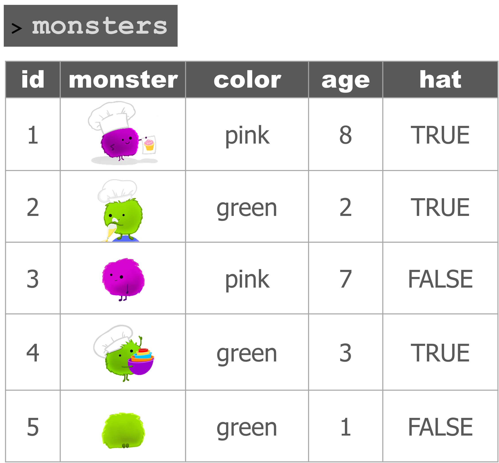
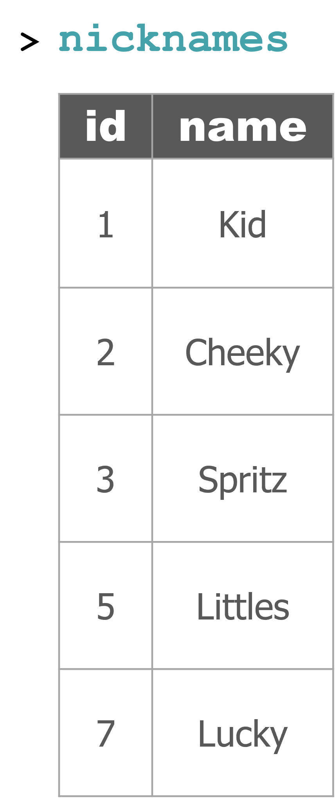
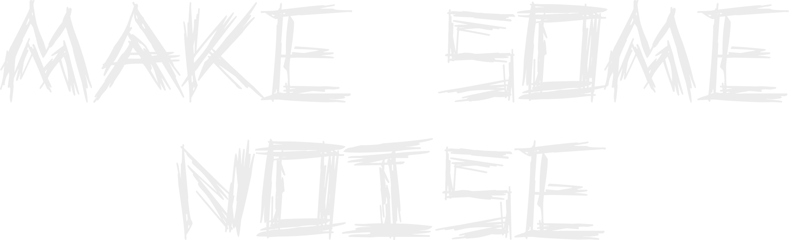
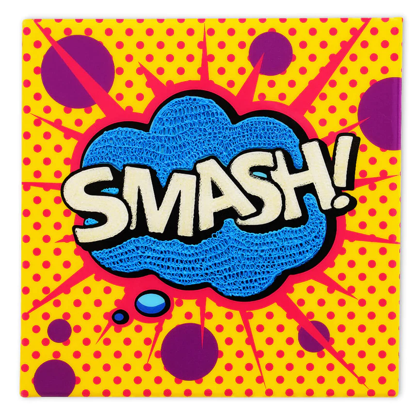
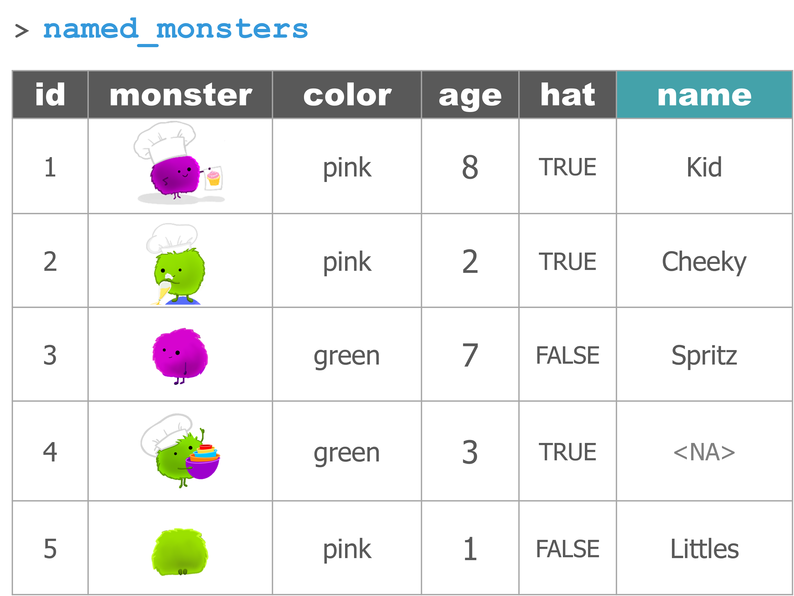
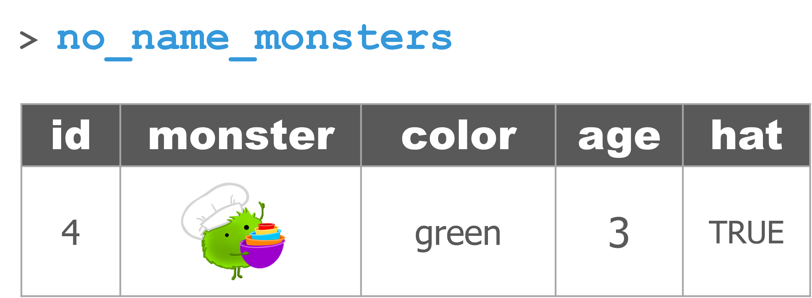
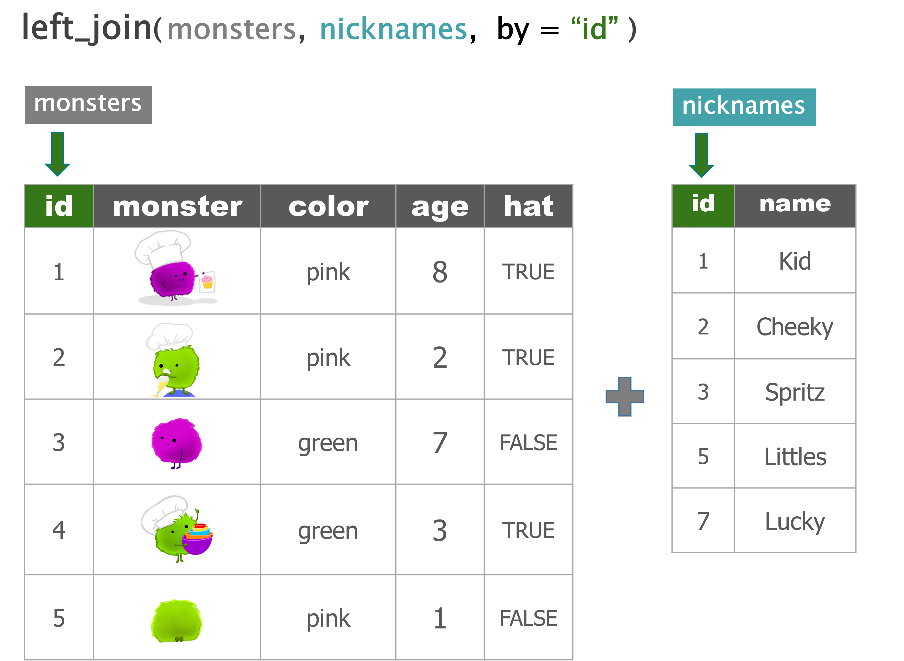

```{r setup, include=FALSE}
library(rmarkdown)
library(knitr)
library(tidyverse)

xaringanExtra::use_clipboard()

opts_chunk$set(error=TRUE, color=NULL, message=FALSE, warning=FALSE, eval=T, dpi=230)
htmltools::tagList(rmarkdown::html_dependency_font_awesome())
```

```{r xaringan-animate-css, echo=FALSE}
xaringanExtra::use_animate_css()
```

class: fadeOut

background-image: url(../images/tv_fuzz_whitenoise.gif)
background-size: cover

<link href='https://fonts.googleapis.com/css?family=Londrina Sketch' rel='stylesheet'>

<link rel="preconnect" href="https://fonts.googleapis.com">
<link rel="preconnect" href="https://fonts.gstatic.com" crossorigin>
<link href="https://fonts.googleapis.com/css2?family=Gluten:wght@100&family=Holtwood+One+SC&family=Kalam:wght@300&family=Londrina+Sketch&family=Metal+Mania&family=Source+Sans+3:wght@300;500;600;700&display=swap" rel="stylesheet">

<style>
@import url('https://fonts.googleapis.com/css2?family=Gluten:wght@100&family=Kalam:wght@300&family=Londrina+Sketch:wght@500;700&family=Metal+Mania&family=Source+Sans+3:wght@300;500;600;700&display=swap');

.black {background-color: black;}

<style>

.noise h1 {position: absolute;
    top: 174px;
    left: 94px;
    font-size: 8.3rem !important;
    font-weight: bold;
    font-family: "Holtwood One SC" !important;
    color: white;}
.sketch2 {font-family: "Londrina Sketch" !important; font-weight: 900;}
.metal {font-family: "Metal+Mania"; font-weight: 700;}
.metal2 {font-family: "Metal+Mania"; font-weight: 700; text-decoration: underline overline;}
.bright-red {color: #f62e14; opacity: 1;}
.transparent {opacity: 0}

.small-font h1 {font-size: 4.3rem !important;}
.teal h3 {font-weight: bold;}
.bigchart {margin-top: -10px; margin-left: -5%; width: 110%;}
.wider {width: 107%;}
img {max-width: 120%; width: 100%;}
.clear {clear:both;}
h2, h3 {color: black; padding-bottom: 28px;}

.pull-right img {width: 139%;
    max-width: 139%;
    margin-left: -38px;
    margin-top: -20px;}
    
.pull-left .remark-code-line {font-size: 1.49rem;}
.pull-up {margin-top: -28px;}

.small-font {font-size: 1.2rem;}
.small-font .remark-code-line {font-size: 1.5rem;}
.med-font .remark-code-line {font-size: 1.7rem;}

.shift-up {margin-top: -20px;}
.shift-left {margin-left: -28px;}
.small-shift-left {margin-left: -60px;}
.shift-right {margin-left: 180px;}
.shift-down {padding-top: 2px;}

.remark-slide table {width: 108%; font-size: 1.4rem;}
.small-table table {width: 39%;}

.remark-code {width: 104%;}
.remark-code-line {font-size: 1.75rem; line-height: 1.37;}

</style>


<div class="animated flash" style="position: absolute; top: 120px; right: 120px; background-color: darkgrey; height: 100px; min-width: 100px; opacity: 0.8 !important;">

<p class="animated flash teal" style="margin-top: 28px; margin-left: 34px;">03</p>

</div>

---
class: animated, fadeOut
background-image: url(../images/tv_fuzz_whitenoise.gif)
background-size: cover

<div class="" style="position: absolute; top: 120px; right: 120px; background-color: darkgrey; height: 100px; min-width: 100px; opacity: 0.82 !important;">

<p class="animated infinite flash teal" style="margin-top: 28px; margin-left: 34px;">44</p>

</div>


---
class: inverse, center, middle, animated, infinite, pulse

<image src="../images/boxing_ring.webp" style="position: absolute; top: 0; left: 0; width: 100%; max-width: 200%; opacity: 0.6; z-index: -99;">

<div class="animated bounceInDown" style="margin-top: -164px;">

<h1> .metal2[.bigger[.big[WW]]] </h1>
<h2> .metal[.smaller[.transparent[ DATAFRAME ]]] </h2>
<h1> .metal2[.bigger[.big[SMASH]]] </h1>

</div>

<h2 class="animated heartBeat" style="margin-top: -280px;"> .metal[.smaller[.bright-red[ DATAFRAME ]]] </h2>


---
class: inverse, center, middle, animated, zoomIn
exclude: true

<div class="animated infinite pulse">

<image src="../images/boxing_ring.webp" style="position: absolute; top: 0; left: 0; width: 100%; max-width: 200%; opacity: 0.6; z-index: -99;">

</div>

<div class="animated bounceInDown">

<h1> .metal2[.bigger[.big[WW]]] </h1>
<h2> .metal[.smaller[.bright-red[ DATAFRAME ]]] </h2>
<h1> .metal2[.bigger[.big[SMASH]]] </h1>

</div>


---
class: inverse, center, middle, animated, infinite, pulse, fadeOut
exclude: true

<image src="../images/boxing_ring.webp" style="position: absolute; top: 0; left: 0; width: 100%; max-width: 200%; opacity: 0.6; z-index: -99;">

<h1> .metal2[.bigger[.big[WW]]] </h1>

<div class="animated heartBeat">

<h2> .metal[.smaller[.bright-red[ DATAFRAME ]]] </h2>

</div>

<h1> .metal2[.bigger[.big[SMASH]]] </h1>


---
class: inverse, right, animated, infinite, pulse
background-image: url(../images/wrestle_vs.jpg)
background-size: cover


---
class: inverse, right
background-image: url(../images/wrestle_vs.jpg)
background-size: cover







---
class: inverse, right
background-image: url(../images/wrestle_vs.jpg)
background-size: cover


---
class: inverse, right, animated, fadeOut
background-image: url(../images/wrestle_vs.jpg)
background-size: cover


---
class: inverse, center, middle, animated, fadeIn
exclude: true

<image class="animated infinite pulse" src="../images/noise_particles.gif" style="margin-top: -130px; margin-left: -131px; width: 128%; max-width: 128%;">


---
class: inverse, center, middle, animated, fadeIn

<image class="animated infinite pulse" src="../images/noise_particles.gif" style="margin-top: -130px; margin-left: -131px; width: 128%; max-width: 128%;">


<div class="animated fadeIn">


    
</div>

---
class: inverse, left, animated, infinite, pulse
exclude: true

<image class="" src="../images/noise_waves.webp" style="position: absolute; top: -332px;
    left: -151px;
    width: 131%;">


---
class: inverse, center, animated, fadeIn

# .big[.bigger[ROUND 1]]

<br>

<h1 class="animated infinite heartBeat"> .big[.big[.blue[ ? ]]] </h1>

---
class: inverse, center, animated

# .big[.bigger[ROUND 1]]

<br>

<h1 class="animated rubberBand"> .bigger[.big[.blue[left_join( )]]] </h1>


---
class: inverse, center, animated, fadeIn

# .big[.bigger[ROUND 1]]

<br>

.small-font[

# .blue[left_join(].gray[monsters], .teal[nicknames].blue[)]

]

---
class: inverse, middle, center, animated, fadeIn

<h1 class="animated pulse">  .bigger[.big[.big[.big[.teal[ 3 ]]]]]


---
class: inverse, middle, center, animated, fadeIn


<h1 class="animated pulse"> .big[.big[.big[.teal[ 2 ]]]] </h1>

---
class: inverse, middle, center, animated, fadeIn

<h1 class="animated pulse"> .big[.big[.teal[ 1 ]]] </h1>


---
class: inverse, middle, center, animated, fadeIn
exclude: true


---
class: inverse, middle, center, animated, fadeIn, fadeOut




---
class: inverse, middle, center, animated, fadeIn




---
class: inverse, right, animated, fadeIn
background-image: url(../images/wrestle_vs.jpg)
background-size: cover


---
class: inverse, right
background-image: url(../images/wrestle_vs.jpg)
background-size: cover


---
class: inverse, right, animated, fadeOut
background-image: url(../images/wrestle_vs.jpg)
background-size: cover


---
class: inverse, center, animated, fadeIn

# .big[.bigger[ROUND 2]]

<br>

<h1 class="animated infinite heartBeat"> .big[.big[.blue[ ? ]]] </h1>


---
class: inverse, center, animated

# .big[.bigger[ROUND 2]]

<br>

<h1 class="animated jello"> .bigger[.big[.blue[anti_join( )]]] </h1>


---
class: inverse, center, animated, fadeIn

# .big[.bigger[ROUND 2]]

<br>

.small-font[

# .blue[anti_join(].gray[monsters], .teal[nicknames].blue[)]

]

---
class: inverse, center, black

<h1 class="animated infinite tada" style="color: #1f9f4f; font-size: 7.3rem !important;"> MAKE SOME NOISE </h1>

<image class="animated infinite pulse" src="../images/noise_meter_decibels.gif" style="position: absolute; top: 20px; left: -15px; width: 102%; max-width: 121%;">


---
class: inverse, middle, center, black, animated, fadeIn

<h1 class="animated pulse">  .bigger[.big[.big[.big[.teal[ 3 ]]]]]

---
class: inverse, middle, center, black, animated, fadeIn


<h1 class="animated pulse"> .big[.big[.big[.teal[ 2 ]]]] </h1>

---
class: inverse, middle, center, black, animated, fadeIn

<h1 class="animated pulse"> .big[.big[.teal[ 1 ]]] </h1>


---
class: inverse, middle, center, black, animated, fadeOut
exclude: true


---
class: inverse, middle, center, black, animated, fadeIn


---
class: inverse, middle, center, animated, fadeIn




---
class: inverse, middle, center, animated, fadeIn


<div class="animated flash" style="position: absolute; top: 120px; right: 120px; background-color: darkgrey; height: 100px; min-width: 100px; opacity: 0.8 !important;">

<p class="animated infinite flash teal" style="margin-top: 28px;margin-left: auto; margin-right: auto;">03</p>

</div>

---
class: animated, fadeIn, fadeOut
background-image: url(../images/tv_fuzz_whitenoise.gif)
background-size: cover

<div class="animated flash" style="position: absolute; top: 120px; right: 120px; background-color: darkgrey; height: 100px; min-width: 100px; opacity: 0.8 !important;">

<p class="teal" style="margin-top: 28px; margin-left: 34px;">03</p>

</div>

---
class: animated, fadeOut
background-image: url(../images/tv_fuzz_whitenoise.gif)
background-size: cover

<div class="animated flash" style="position: absolute; top: 120px; right: 120px; background-color: darkgrey; height: 100px; min-width: 100px; opacity: 0.8 !important;">

<p class="animated infinite flash teal" style="margin-top: 28px; margin-left: 34px;">12</p>

</div>

---
class: inverse, middle, center, animated, fadeIn

# .big[.bigger[.teal[ JOINS ]]]

<div class="" style="position: absolute; top: 120px; right: 120px; background-color: darkgrey; height: 100px; min-width: 100px; opacity: 0.7 !important;">

<p class="animated flash teal" style="margin-top: 28px; margin-left: auto; margin-right: auto;">12</p>

</div>

---
class: inverse, middle, center, animated, fadeIn

# .big[.bigger[.teal[ JOINS ]]]


---
class: inverse, middle, center

# .big[.bigger[.blue[ left_join( ) ]]]

---
class: center, middle, animated, fadeIn


---
class: inverse, middle, animated, fadeIn

.small-font[.shift-left[

# .blue[left_join(].gray[left_table], .blue[)]

]]

---
class: inverse, middle

.small-font[.shift-left[


# .blue[left_join(].gray[left_table], .teal[right_table].blue[)]

]]


---
class: inverse, middle

.small-font[.shift-left[

# .blue[left_join(].gray[left_table].small[,] .teal[right_table].small[,]
<h1 style="margin-left: 262px;"> .blue[by = ] "shared_column"  .blue[)] </h1>

]]


---

<div style="height: 108px; overflow:hidden;">

</div>

<div style="overflow:hidden; ">

</div>

---
class: center, middle, animated, fadeIn


---
class: inverse, middle, center

# .big[.bigger[.blue[ anti_join( ) ]]]


---
class: center, middle, animated, fadeIn


---
class: inverse, middle, animated, fadeIn

.small-font[.shift-left[


# .blue[anti_join(].gray[left_table].small[,] .teal[right_table].small[,]
<h1 style="margin-left: 282px;"> .blue[by = ] "shared_column"  .blue[)] </h1>

]]


---

<div style="height: 108px; overflow:hidden;">

</div>

<div style="overflow:hidden; ">

</div>


---
class: center, middle, animated, fadeIn


---
class: inverse, middle, center

# .bigger[.bigger[.blue[anti_join( )]]]
# .bigger[---]
# .bigger[.bigger[.blue[filter( )]]]


---
class: inverse

.shift-left[

<br>

.small-font[

# .blue[anti_join(].gray[monsters].small[,] .teal[nicknames].small[,]
<h1 style="margin-left: 282px;"> .blue[by = ] "id"  .blue[)] </h1>

]]


--

<br>

.small-font[.shift-left[

# .blue[filter(].gray[monsters].small[,]
<h1 style="margin-left: 159px;"> !.gray[id] .small[%in%] .teal[nicknames$id] .blue[)] </h1>

]]


---
class: inverse
exclude: true

<br>

## .blue[anti_join]

.small-font[

```{r, eval=F}
no_name_monsters <- anti_join(monsters, nicknames,
                              by = "id")
```

]


## .blue[filter]

.small-font[

```{r, eval=F}
no_name_monsters <- filter(monsters,
                           !id %in% nicknames$id)
```

]


---
class: inverse, center, middle

# <i class="fas fa-carrot" aria-hidden="true"></i> [Back to Videos](https://tidy-mn.github.io/R-camp-penguins/index.html)
