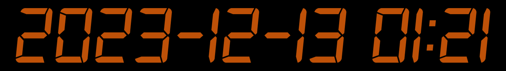
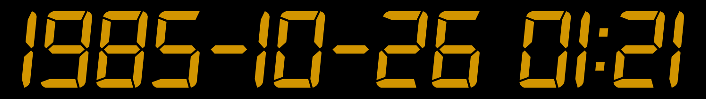

```{r setup, include=FALSE}
library(rmarkdown)
library(knitr)
library(tidyverse)
library(countdown)

xaringanExtra::use_clipboard()

opts_chunk$set(error=TRUE, color=NULL, message=FALSE, warning=FALSE, eval=T, dpi=230)
htmltools::tagList(rmarkdown::html_dependency_font_awesome())
```

```{r xaringan-animate-css, echo=FALSE}
xaringanExtra::use_animate_css()
```

class: animated, fadeOut, center

<style>
#fireworks {
  background-color: white;
}

#fireworks.finished {
  background-color: black;
  background-image: url(../images/fireworks.gif);
  background-size: cover;
  color: white;
}
</style>

```{r, echo=F, out.width="90%"}
countdown(id = "fireworks",
          #start_immediately = TRUE,
          play_sound = T, #"https://tidy-mn.github.io/R-camp-slides/sound/microwave_ping_mono.wav",
          blink_colon = TRUE,
          #warn_when = 3,
          minutes = 0, 
          seconds = 5,
          bottom = "auto",
          left = 0, 
          right = 0,
          padding = "50px",
          margin = "11%",
          font_size = "6em")
```


<link href='https://fonts.googleapis.com/css?family=Orbitron' rel='stylesheet' type='text/css'>
<link rel="preconnect" href="https://fonts.googleapis.com">
<link rel="preconnect" href="https://fonts.gstatic.com" crossorigin>
<link href="https://fonts.googleapis.com/css2?family=Gluten:wght@100&family=Holtwood+One+SC&family=Kalam:wght@300&family=Source+Sans+3:wght@300;500;600;700&display=swap" rel="stylesheet">

<style>
@import url('https://fonts.googleapis.com/css2?family=Gluten:wght@100&family=Kalam:wght@300&family=Londrina+Sketch:wght@500;700&family=Metal+Mania&family=Source+Sans+3:wght@300;500;600;700&display=swap');

.black {background-color: black;}

<style>

.clock {font-family: 'Orbitron, sans-serif'; font-weight: 400;}

.noise h1 {position: absolute;
    top: 174px;
    left: 94px;
    font-size: 8.3rem !important;
    font-weight: bold;
    font-family: "Holtwood One SC" !important;
    color: white;}
.sketch2 {font-family: "Londrina Sketch" !important; font-weight: 900;}
.metal {font-family: "Metal+Mania"; font-weight: 700;}
.metal2 {font-family: "Metal+Mania"; font-weight: 700; text-decoration: underline overline;}
.bright-red {color: #f62e14; opacity: 1;}
.transparent {opacity: 0}

.small-font h1 {font-size: 4.3rem !important;}
.teal h3 {font-weight: bold;}
.bigchart {margin-top: -10px; margin-left: -5%; width: 110%;}
.wider {width: 107%;}
img {max-width: 120%; width: 100%;}
.clear {clear:both;}
h2, h3 {color: black; padding-bottom: 28px;}

.pull-right img {width: 139%;
    max-width: 139%;
    margin-left: -38px;
    margin-top: -20px;}
    
.pull-left .remark-code-line {font-size: 1.49rem;}
.pull-up {margin-top: -28px;}

.small-font {font-size: 1.2rem;}
.small-font .remark-code-line {font-size: 1.5rem;}
.med-font .remark-code-line {font-size: 1.7rem;}

.shift-up {margin-top: -20px;}
.shift-left {margin-left: -28px;}
.small-shift-left {margin-left: -60px;}
.shift-right {margin-left: 180px;}
.shift-down {padding-top: 2px;}

.remark-slide table {width: 108%; font-size: 1.4rem;}
.small-table table {width: 39%;}

.remark-code {width: 104%;}
.remark-code-line {font-size: 1.75rem; line-height: 1.37; color: #223035;}

</style>


---
class: center, animated, slideOutRight


<div class="animated fadeInLeft" style="margin-top: -119px; margin-left: -980px; height: 100px; min-width: 100px; opacity: 0.8 !important;">



</div>

---
class: center, animated, slideInLeft


---
class: center, animated, fadeOut


<div class="animated fadeInLeft" style="margin-top: -119px; margin-left: -980px; height: 100px; min-width: 100px; opacity: 0.8 !important;">



</div>


---
class: inverse, center, middle, animated, infinite, pulse

<div class="animated bounceInDown" style="margin-top: -4px;">

<h1> .teal[.bigger[.big[DATES]]] </h1>
<h1><b> .big[ --- ] </b></h1>
<h1> .teal[.bigger[.big[TIME]]] </h1>

</div>


---
class: inverse, center, middle, black

# .big[.blue[Step 1]]
## .big[Become a date]


---
class: inverse, center, middle, black, animated, fadeIn


<div class="" style="margin-top: 25px; margin-bottom: 15px; opacity: 0.8 !important;">


</div>

---
class: inverse, center, middle, black, animated, fadeIn
exclude: true

<style>
.wide {letter-spacing: 15px;}
.bigs {width: 105%; opacity: 0.75}
</style>

<div class="" style="margin-top: 25px; margin-bottom: 15px; opacity: 0.8 !important;">


</div>

.bigs[

<h1 style="font-size: 107px !important; float: left; margin-left: 1px;"> 
.gray[.wide[YYY]Y]  
</h1>
<h1 style="font-size: 107px !important; float: left; margin-left: 47px;"> 
.gray[MM]
</h1>

<h1 style="font-size: 107px !important; float: left; margin-left: 44px;"> 
.gray[DD] 
</h1>

]


---
class: inverse, center, middle, black

<style>
.wide {letter-spacing: 15px;}
.bigs {width: 105%; opacity: 0.75}
</style>

<div class="" style="margin-top: 25px; margin-bottom: 15px; opacity: 0.8 !important;">


</div>

.bigs[

<h1 style="font-size: 107px !important; float: left; margin-left: 1px;"> 
.gray[.wide[YYY]Y]  
</h1>
<h1 style="font-size: 107px !important; float: left; margin-left: 47px;"> 
.gray[MM]
</h1>

<h1 style="font-size: 107px !important; float: left; margin-left: 44px;"> 
.gray[DD] 
</h1>

<h1 style="font-size: 107px !important; float: left; margin-left: 94px;"> 
.gray[H:M] 
</h1>
]


---
exclude: true

# Convert ".teal[text]" to a .blue[DATE]

<br>

.bluecode[

| Function    |  Order of date elements                                 |
|:----|:-----------------------------------------------------------------|
|`mdy(`date`)  `    | Month-Day-Year ~ "<span class="teal">05-18-2023</span>" or <span class="teal">05/18/2023</span>                |
|`dmy()  `    | Day-Month-Year (Euro dates) ~ <span class="teal">18-05-2023</span> or <span class="teal">18/05/2023</span>  |
|`ymd()  `    | Year-Month-Day (Science dates) ~ <span class="teal">2023-05-18</span> or <span class="teal">2023/05/18</span> |
|`ymd_hms() ` | Year-Month-Day Hour:Minutes:Seconds ~  <span class="teal">2023-05-18 8:35:22 AM</span>   |

]

---
exclude: false

# Convert ".teal[text]" to a .blue[DATE]

<br>

.bluecode[

| Order of components | Function   | |
|:----|:-----------------------------------------------------------------|---:|
| Month-Day-Year ~ "<span class="teal">05-18-2023</span>" or "<span class="teal">05/18/2023</span>"                | `mdy(`date`)  `    |  |
| Day-Month-Year (Euro dates) ~ "<span class="teal">18-05-2023</span>" or "<span class="teal">18/05/2023</span>"  | `dmy()  `    | |
| Year-Month-Day (Science dates) ~ "<span class="teal">2023-05-18</span>" or "<span class="teal">2023/05/18</span>" | `ymd()  `    | |
| Year-Month-Day Hour:Minutes:Seconds ~  "<span class="teal">2023-05-18 8:35:22 AM</span>"   | `ymd_hms() ` | |

]

---
exclude: false

# <i class="fa fa-clock teal" aria-hidden="true"></i> Real world dates

<br>

.teal[**Month**]-.teal[**Day**]-.teal[**Year**] **dates**

.bluecode[

| Format |  Function to use         | |   
|:------|:-------------------------|---:|  
| "<span class="teal">05/18/2023 </span>" | `mdy(`date`)  ` |  |
| "<span class="teal">May 18, 2023 </span>"| `mdy(`date`)  `       | |
| "<span class="teal">05/18/2023 8:00 CDT </span>"| `mdy_hm(`date`, tz = `"US/Central"`)  `| |
| "<span class="teal">05/18/2023 11:05:32 GMT </span>"| `mdy_hms(`date`, tz = `"GMT"`)  `| |

]

---
exclude: true

# <i class="fa fa-clock teal" aria-hidden="true"></i> Real world dates

<br>

.teal[**Month**]-.teal[**Day**]-.teal[**Year**] **dates**

.bluecode[

| Function to use |  Format       |   
|:--------|:-------------------------|  
| `mdy(`date`)  ` |   "<span class="teal">05/18/2023</span>" |
| `mdy(`date`)  `       | "<span class="teal">May 18, 2023</span>"| 
| `mdy_hm(`date`, tz = `"US/Central"`)  `| "<span class="teal">05/18/2023 8:00 CDT</span>"|
| `mdy_hms(`date`, tz = `"GMT"`)  `| "<span class="teal">05/18/2023 11:05:32 GMT</span>"| 

]
---

# <i class="fa fa-clock teal" aria-hidden="true"></i> Real world dates

<br>

.teal[**European**] **dates**

.bluecode[

| Format |  Function to use         |      | 
|:--------|:-------------------------|----:| 
| "<span class="teal">18-05-2023</span>" | `dmy(`date`) `  |    |
| "<span class="teal">18/05/2023</span>" | `dmy(`date`) `  |   |

]

---

# <i class="fa fa-clock teal" aria-hidden="true"></i> Real world dates

<br>

.teal[**No nonsense**] **dates**

.bluecode[

| Format |  Function to use         |   
|:--------|:-------------------------| 
| "<span class="teal">20230518</span>" | `ymd(`date`, tz = `"US/Central"`) `  |
| "<span class="teal">202305180630</span>" | `ymd_hm(`date`, tz = `"US/Central"`) `  |

]


---
class: inverse, center, middle, black

# .big[.blue[Step 2]]
## .big[Sort your components]


---
class: animated, fadeIn
background-image: url(../images/lubridate_sort_allison_horst.png)
background-size: 96%


---

<h1 style="margin-bottom: 60px;"> Date parts </h1>

.bluecode[

| Function   |  Date component                                           |
|----|:-----------------------------------------------------------------|
|`year(`date`)  `  | Year          |
|`month()`   | Month: _1, 2, 3_; Use <span class="teal">label=TRUE</span> for _Jan, Feb, Mar_  |
|`day()`     | Day of the month  |
|`wday()`    | Day of the week: _1, 2, 3_; Use <span class="teal">label=TRUE</span> for _Sun, Mon, Tue_  |
| _- Time -_   |            |
|`hour() `   |  Hour of the day _(24hr)_ |
|`minute() ` |  Minutes   |
|`second() ` |  Seconds   |
|`tz()  `    |  Time zone |

]

---
class: inverse, center, middle, black

# .big[.blue[Step 3]]
## .big[Show your style]


---

# <i class="fa-solid fa-stamp"></i> [.teal[**Stamp**]] your dates

<br>


```{r, message=F}
report_style <- stamp_date("Reported on December 15th, 2023")
```

--


```{r, eval=F}
new_date <- ymd("2024-05-15")
```

--

```{r, eval=F}
report_style(new_date)
```

--

## .teal["Reported on May 15th, 2024"]

```{r, echo=F, eval=F}
new_date <- ymd("2024-05-15")

report_style(new_date)
```


---
class: inverse, center, middle, animated, fadeIn, fadeOut


<h1 class="animated pulse" style="font-size: 9rem !important;"> MONSTERS .blue[**EVERYWHERE!**] </h1>


---
class: inverse, center, animated, fadeIn

<div class="animated flash" style="overflow: hidden; margin-top: -36px;
    width: 130%;
    margin-left: -15%;">


</div>

<h1 class="animated bounceInUp" style="position: absolute; bottom: -20px;"> MONSTERS .blue[**EVERYWHERE!**] </h1>


---
class: inverse, center, middle

# <i class="fas fa-carrot" aria-hidden="true"></i> [Back to Videos](https://tidy-mn.github.io/R-camp-penguins/index.html)
