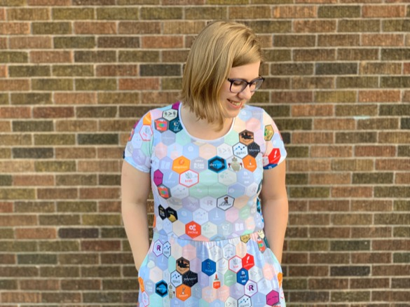

```{r setup, include=FALSE}
library(rmarkdown)
library(knitr)
library(magrittr)

opts_chunk$set(error=TRUE, color=NULL, message=FALSE, eval=T)
htmltools::tagList(rmarkdown::html_dependency_font_awesome())
```

exclude: true
class: inverse, center, middle

# .big[Welcome to] 
# .huge[[.teal[R]]]

---
class: inverse, center, middle

# .big[RStudio] 
# .huge[.teal[TOUR]]

---

```{r Rtour, child='../../modules-slides/intro/rstudio_tour/general_notes.Rmd'}
```


---
class: inverse

# .teal[R] packages 


---
class: inverse
exclude: true

# .teal[R] packages 




---
class: inverse, middle

# Install packages 

<style>
code {
  padding: 30px !important;
  padding-left: 38px !important;
  border-left: solid 12px #50e3c2;
  font-size: 1.5rem !important;
}
</style>

.big[

```{r, eval=F}
install.packages("tidyverse")
```

]

---
class: inverse, center, middle

# <i class="fas fa-carrot" aria-hidden="true"></i> [Back to Videos](r-camp.netlify.app/page/videos)


