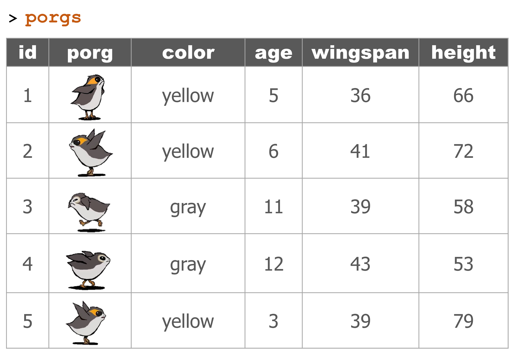
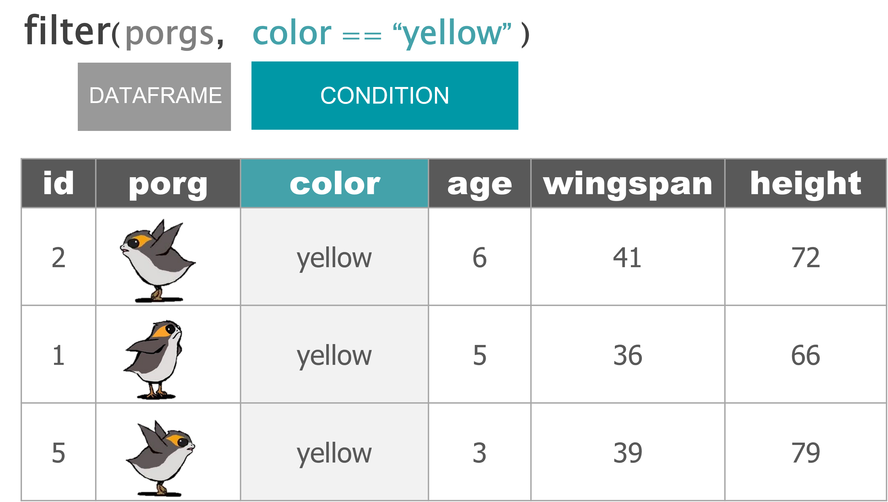
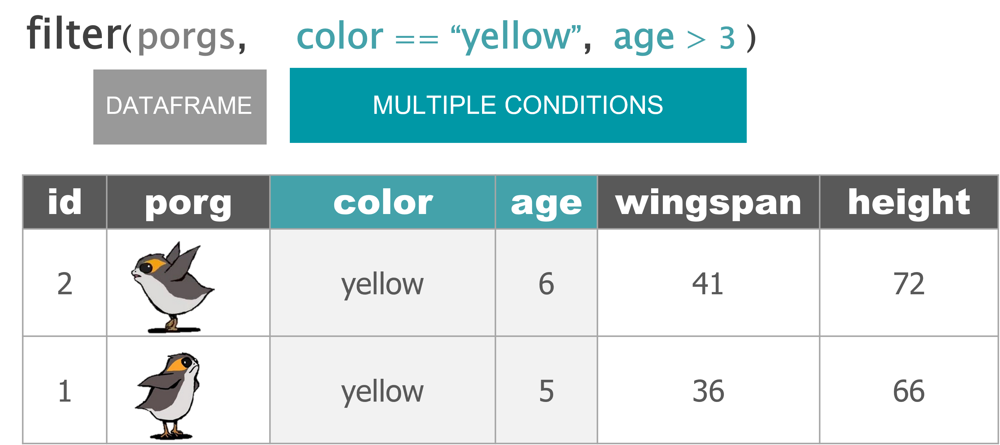

```{r setup, include=FALSE}
library(rmarkdown)
library(knitr)
library(magrittr)

xaringanExtra::use_clipboard()

opts_chunk$set(error=TRUE, color=NULL, message=FALSE, eval=T)
htmltools::tagList(rmarkdown::html_dependency_font_awesome())
```


class: inverse, center, middle
exclude: true

# .big[TABLES] 
# .huge[.teal[DATAFRAMES]]

---
class: inverse

```{r child = '../../modules-slides/base/base_dataframes/bakery.Rmd'}
```

---
class: 

<style>
.aqua {color: #0098a6;}
.gray {color: gray;}

</style>


# Filter .gray[data]



---

# Filter .gray[data] on .aqua[condition] 



---

# Filter .gray[data] on .aqua[conditions]  




---
exclude: true

<ul class="nav nav-pills" id="myTab" role="tablist" style="margin-top: 18px;">
<li class="nav-item active">
  <a class="nav-link" id="porgs-tab" data-toggle="tab" href="#porgs" role="tab" aria-controls="porgs" aria-selected="true"> porgs </a>
</li>
<li class="nav-item">
 <a class="nav-link" id="filter3-tab" data-toggle="tab" href="#filter3" role="tab" aria-controls="filter3" aria-selected="false"> `filter`</a>
</li>
</ul>

<div class="well tab-content" id="myTabContent" style="background-color: white;">

<div class="tab-pane fade active in" id="porgs" role="tabpanel" aria-labelledby="porgs-tab">

{style="width: 85%;"}

<br><br>

</div>


<div class="tab-pane fade" id="filter3" role="tabpanel" aria-labelledby="filter3-tab">

{style="width: 95%; margin-top: 12px;"}

<br><br>

{style="width: 95%;"}

<br><br>

</div>

</div></div>

---
class: inverse, center, middle

# <i class="fas fa-carrot" aria-hidden="true"></i> [Back to Videos](r-camp.netlify.app/page/videos)
